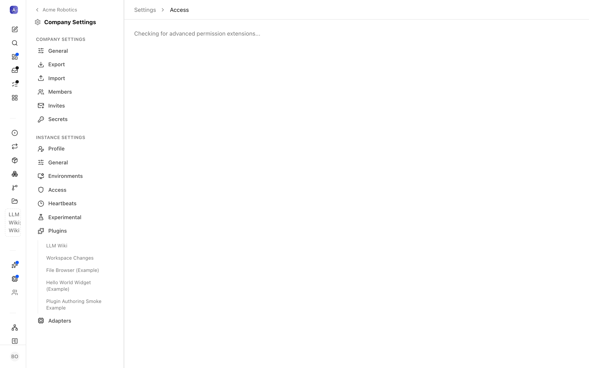

# Roles & Permissions

This is the reference for how human access is decided inside a company. If you want the click-by-click tour of the Access & Members page, that lives in [Company Administration](./company.md); this page is the lookup table behind it — every role, every permission key, and the rule Paperclip uses to combine them.

Two layers stack on top of each other:

- **Membership role** — a company-scoped label (`Owner`, `Admin`, `Operator`, `Viewer`) that carries a bundle of *implicit* grants.
- **Explicit grants** — individual permission keys you check on a member, on top of whatever their role already gives them.

There is also one layer that sits *above* the company: the **instance admin**, covered at the end.

> **Note:** Humans and agents run through the *same* permission engine — a grant is resolved against `(company, principal type, principal id, permission key)` whether the principal is a person or an agent. This page describes the human side. The agent reporting tree (CEO, managers, reports) is a separate concept; see [Org Structure](../guides/org/org-structure.md).

---

## The four company roles

| Role | Who it's for | Implicit grants |
|---|---|---|
| **Owner** | The people who run the company | `agents:create`, `skills:create`, `environments:manage`, `users:invite`, `users:manage_permissions`, `tasks:assign`, `joins:approve` |
| **Admin** | Trusted operators who onboard people and agents | `agents:create`, `skills:create`, `environments:manage`, `users:invite`, `tasks:assign`, `joins:approve` |
| **Operator** | Hands-on members who help run the work | `tasks:assign` |
| **Viewer** | Read-only observers | *(none)* |

The only difference between **Owner** and **Admin** is `users:manage_permissions` — an Admin can invite people and approve them, but cannot change other members' roles or grants. That is deliberately reserved for Owners.

A fifth option, **Unset**, appears in the role drop-down. It leaves the member with no implicit grants at all — useful when you want to hand-pick permissions with explicit grants and nothing else. (Under the hood the older value `member` is treated as `operator`.)

---

## The permission keys

There are ten permission keys. Seven of them show up as defaults on one or more roles; three are **explicit-grant-only** — no role includes them, so a member only ever gets them if you check the box in the member editor.

| Permission key | What it allows | In which role by default |
|---|---|---|
| `agents:create` | Create (hire) new agents in the company | Owner, Admin |
| `skills:create` | Create and manage company skills | Owner, Admin |
| `environments:manage` | Create, edit, and remove the execution environments agents run in | Owner, Admin |
| `users:invite` | Create and revoke company invite links | Owner, Admin |
| `users:manage_permissions` | View and change members' roles and grants | Owner |
| `tasks:assign` | Assign any issue to any agent or member in the company | Owner, Admin, Operator |
| `tasks:assign_scope` | Assign issues, but only within a constrained scope (for example, a single manager's subtree). This is the *scoped fallback* Paperclip checks when a principal does **not** hold the broad `tasks:assign` grant | — (explicit only) |
| `tasks:manage_active_checkouts` | Reassign or clear an issue that another assignee currently holds checked out — an override for unsticking work | — (explicit only) |
| `pipelines:write` | Create and modify pipeline automations | — (explicit only) |
| `joins:approve` | Approve or reject human and agent join requests | Owner, Admin |

### About the explicit-only keys

Three keys never appear in a role's defaults, so a member only receives them through an explicit grant in the member editor:

- **`tasks:assign_scope`** is how you let someone delegate *within their lane* without giving them company-wide assignment power. When a member has `tasks:assign_scope` but not `tasks:assign`, Paperclip evaluates the grant against the scope attached to it and allows the assignment only if the target falls inside that scope. Set the scope in the grant payload (via the member editor's grant, or `member role-and-grants` on the CLI).
- **`tasks:manage_active_checkouts`** is an escape hatch. Normally an issue that an agent has checked out is off-limits to others until it's released; this grant lets the holder reassign or clear that active checkout — handy when an agent has stalled mid-task.
- **`pipelines:write`** lets a member create and edit pipeline automations. Grant it to whoever runs your pipelines; it is kept off the standard roles so pipeline authorship is a deliberate choice.

---

## How grants combine (precedence)

The rule is simple and additive:

1. Start with the implicit grants from the member's **role**.
2. **Add** every explicit grant checked on the member.

There is no "deny" layer — explicit grants only ever *add* capability, and they are stored independently of the role. The practical consequence worth remembering:

> An explicit grant **persists across a role change.** If you promote a Viewer to Operator and later demote them back to Viewer, any boxes you checked by hand are still checked. Changing the role only swaps the implicit bundle; it never clears explicit grants. To fully strip a member back, uncheck their explicit grants *and* set the role appropriately (or **Unset**).

---

## Instance admin — the layer above companies

Everything above is company-scoped. One role sits outside any single company: **instance admin** (`instance_admin`).

An instance admin can:

- reach and administer **every** company on the instance, including ones they are not a member of;
- promote and demote other instance admins;
- manage which companies each user can access (`admin user company-access`).

Instance admin is granted from the Instance Access page or the CLI (`paperclipai admin user promote <user-id>`), not from the company role drop-down. It is independent of company roles — a person can be an instance admin without being a member of a given company, in which case the Access page shows a banner noting the admin-level access without membership. See [Settings](./settings.md#instance-access) for the Instance Access surface, and the first instance admin is established through the one-time [board claim](./cli-auth.md) flow.

---

## Good to know (current limits)

A few things about the human access model as it stands today, so they don't surprise you:

- **Invites are copy-link only.** Paperclip does not send invitation emails — you create a link and share it yourself. See [Add a human teammate](../how-to/add-a-human-teammate.md).
- **Removal is admin-driven.** There is no self-serve "leave company"; an Owner or Admin sets a member's status to `suspended` or archives them. See [Offboard a member](../how-to/offboard-a-member.md).
- **Email is read-only in the profile.** Members edit their display name and avatar; the account email is not user-editable from the profile page.
- **No SSO/MFA yet.** Authentication is email + password via Better Auth. There is no single-sign-on, SCIM directory sync, or multi-factor step in the current release.

---

## Where to go next

- [Company Administration](./company.md) — the Access & Members, Invites, and Join Requests pages, click by click.
- [Members & Access](../guides/org/members-and-access.md) — the mental model: humans vs agents as shared principals, roles vs grants, and the member profile page.
- [Access, Profile & Instance Admin (CLI)](../reference/cli/access.md) — the `member`, `invite`, `join`, and `admin user` commands.
