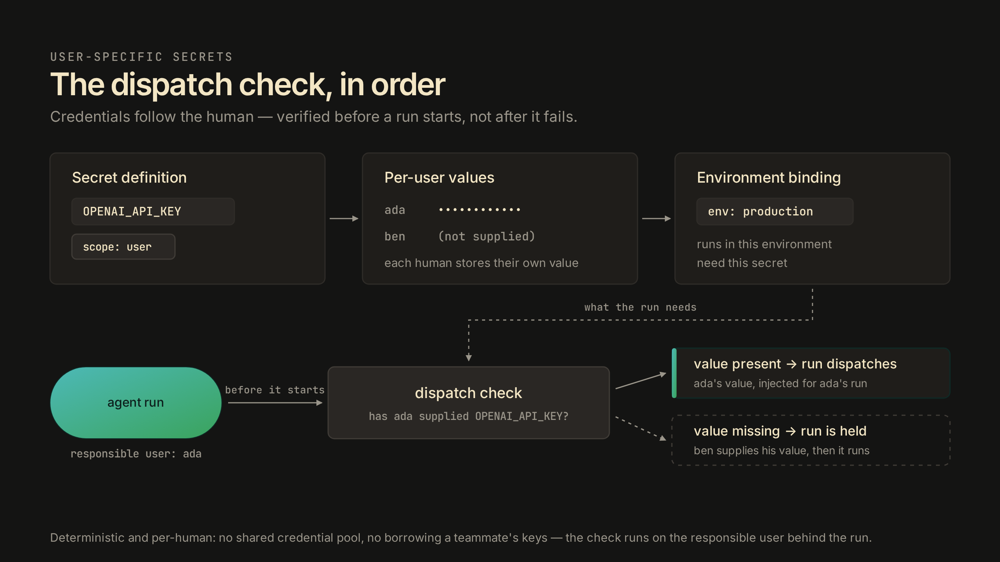
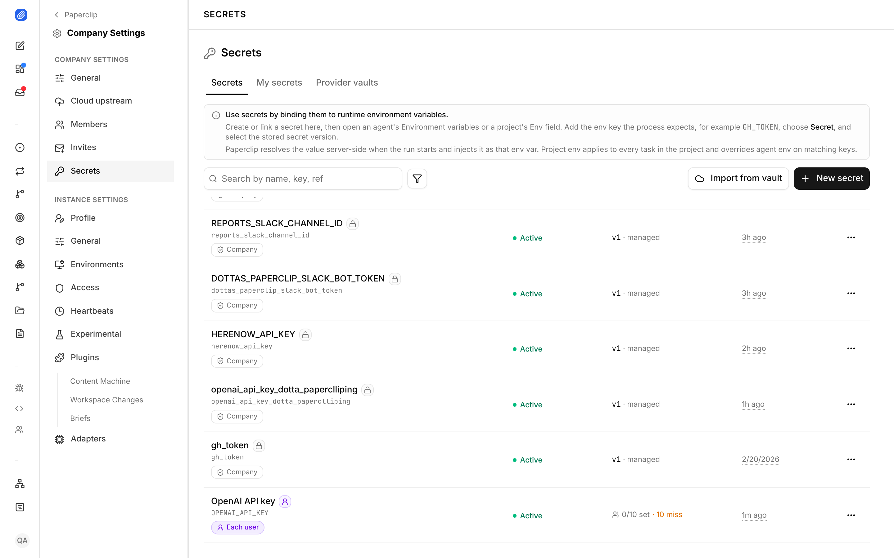
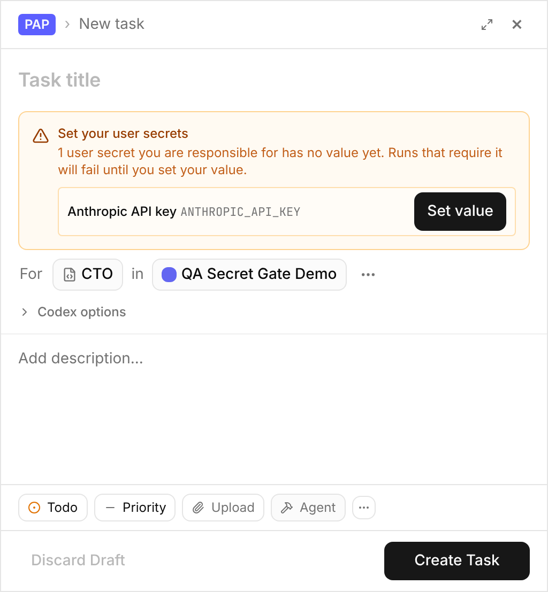

# Secret scopes and the responsible user

A secret in Paperclip has two parts: a definition (the name, and the environments it applies to) and the values stored under it. The definition's scope decides who supplies the value. A company-scoped secret carries one value that every run in the company uses. A user-scoped secret holds a separate value per human, and a run resolves the value belonging to the human responsible for that run. Before a run dispatches, Paperclip checks that the responsible user has supplied every user-scoped value the run needs; if one is missing, the run does not start.

## Why scope exists

Teammates don't share credentials. With a single company-wide value per secret, the moment a second person joins, one of two things happens: their runs borrow someone else's keys, or they can't run agents at all. Borrowed keys are worse than they look. Work executed under another person's credentials can't be attributed to the human who actually asked for it, and per-person rate limits or audit trails on the provider's side stop being accurate.

Per-user values remove that fork. Each human supplies their own value for the same definition, runs execute under the credentials of the person behind them, and adding a teammate never means passing a key around. This is why the capability exists at all: it is a prerequisite for safe multi-user and cloud execution, where several humans drive agents in one company and none of them should be indistinguishable from the others.

## A mental model

A company-scoped secret is a key on a wall hook. Any run can take it, and every run uses the same key. A user-scoped secret is a badge: each person carries their own, and a run presents the badge of the human it is working for. An agent never has a badge of its own; however many agents touch a task, the badge presented is always a human's.

Environment binding decides which doors ask for a badge: a definition bound to an environment declares that runs in that environment need this secret. The dispatch check is the turnstile. It reads the badge before the run enters, not after the run is halfway through the building, and it always gives the same answer for the same badge: either the responsible user has supplied the value or they haven't.

## How a run resolves a secret

Start from the definition. Creating a secret means declaring its scope up front: company, meaning one shared value, or user, meaning one value per human. Scope is a property of the definition, so everyone in the company sees the same definition either way; what differs is who is expected to fill it.

Under a user scope, each person stores their own value for the definition, in the product under Company Settings → Secrets → My secrets. Your value is yours alone: it is used when you are the responsible user for a run, and it is never shown back to anyone, including admins.

Definitions bind to environments, which is how a run comes to need a secret in the first place: the run executes in an environment, and the environment's bound definitions are the secrets it requires.

The last ingredient is attribution. Every run has a responsible user, the human behind it, and that identity is what the secret lookup resolves against. When dispatch evaluates a run, company-scoped needs resolve to the shared value, and user-scoped needs resolve to whatever the responsible user has stored.

The check itself is deterministic and happens before dispatch. If the responsible user has supplied every user-scoped value the run needs, the run proceeds and the values are injected at runtime like any other secret. If any value is missing, the run does not start.

The check also surfaces early. Creating a task whose runs will need a user-scoped value you haven't supplied yet warns you at creation time, with an inline prompt to set the value, rather than waiting for dispatch to hold the run.

The check confirms presence, not correctness. It guarantees the responsible user has supplied a value; a value that is wrong or expired still fails wherever it is actually used. What you are buying is the elimination of one specific failure class: a run that starts, does work, and then dies mid-flight because nobody ever stored the credential it needed.

## Choosing a scope

Scope follows ownership of the credential. Keys that belong to shared infrastructure, such as a database the whole team reads, fit company scope: there is one real value, and splitting it per user would only add busywork. Keys issued to a person, such as an individual API key for an external service, fit user scope: each human already has their own, and the point is that runs use the right one.

The trade-off is real. User scope adds an onboarding step per human: a new teammate's runs are held at dispatch until they supply their values, where a company-scoped secret would have let those runs start immediately. That cost is deliberate, because a run held before it starts, with a clear reason, is cheaper than a run that fails midway or quietly executes on someone else's credentials. But it does mean user scope should not be the reflexive default; for credentials that genuinely are shared, company scope describes reality better.

## Where this sits in the secret model

Scope answers a different question than the rest of the secret model. Providers and vaults, covered in the [Secrets reference](../reference/deploy/secrets.md), decide where secret material is stored and how Paperclip reaches external stores. Scope decides who supplies a value and which runs can use it. Reading that page first helps if you are new to secrets generally; this page assumes the basics and explains only the scoping layer.

## Further reading

- [Secrets reference](../reference/deploy/secrets.md) covers the default provider, provider vaults, strict mode, and migrating inline credentials to secret references.
- [Connect an AWS Secrets Manager vault](../how-to/connect-aws-secrets-vault.md) walks through wiring an external vault.
