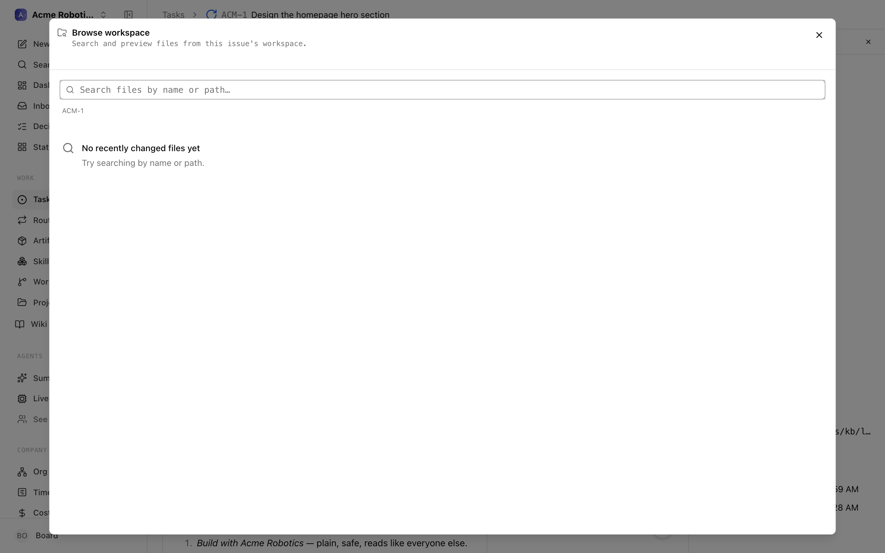

# Experimental File Viewer

When an agent works on a task, the interesting output often isn't the comment thread — it's the files: the report it wrote, the code it changed, the screenshot it saved. Without the file viewer, seeing those means finding the workspace on disk or asking the agent to paste contents into a comment.

The Experimental File Viewer fixes that. It adds controls to every task detail page for **browsing and previewing the task's workspace files right in the browser** — search the tree, open a file, read rendered Markdown, view images and video, copy contents, download, and share deep links to an exact file and line.

## Turn it on

1. Go to **Settings → Instance settings → Experimental**.
2. Turn on **Experimental File Viewer** — *"Show task detail controls for browsing and previewing workspace files relative to a task."*

The setting is instance-wide and takes effect immediately.

## Where it appears

Once enabled, a task detail page grows several entry points to the same viewer:

- A **file icon button** in the task header (desktop only) — tooltip *"Open file… (g f)"*.
- The **`g f` keyboard shortcut** anywhere on a task page.
- A command palette entry — **"Open file in this issue…"**.
- Two links on the task's **Workspace card**: **Browse files…** and **Open file by path…**.
- **Inline file links** — when agent comments, documents, or artifacts reference workspace files, those references become clickable chips that open the viewer at that file. Work products that point at workspace files show up as clickable **Artifacts** chips too.

## Using the viewer

The viewer opens as a large sheet over the task with two modes:

- **Browse mode** — a search box (*"Search files by name or path…"*) plus a file tree. By default it lists recently changed files, so the agent's latest work floats to the top. Type to filter, use the arrow keys and Enter to open a result, or type a full path and press Enter to jump straight to it. Breadcrumbs track the folder you're in.
- **File mode** — a resizable file-tree sidebar on the left and a preview on the right:
  - **Text and code** render with line numbers. If you arrived via a deep link with a line number, that line is highlighted and scrolled into view.
  - **Markdown** gets a toggle between **Rendered** and **Raw**.
  - **Images and video** preview inline.

Header controls in file mode: **Download**, **Copy file contents**, **Copy link to this file view**, and **Close**. The copied link encodes the file, line, and workspace, so a teammate who opens it lands on exactly what you're looking at. If you opened a file from browse mode, **Back to files** (or Esc) returns to the list.

## When it's off

The flag is purely a UI gate. Turning it off hides the header button, shortcut, palette entry, and Workspace-card links, and inline file references render as plain, non-clickable chips. Nothing is deleted, and flipping it back on restores everything.

## Limits and safeguards

- The task needs a **local workspace**. Remote workspaces show *"Remote workspace preview coming soon"*; if an isolated worktree has been cleaned up, the viewer says so instead of previewing.
- **Size caps**: text files up to 512 KB, images/video up to 10 MB. Larger files report *"File is too large to preview"* (you can still download).
- **Sensitive paths are blocked.** The viewer refuses secret-shaped files (`.env`, SSH keys, `.npmrc`, `.netrc`, kubeconfig, anything under `.aws`/`.ssh`/`.docker`/`.kube`) and skips `.git` and `node_modules`. Path traversal outside the workspace is rejected.
- The viewer is **read-only** — browse, preview, copy, download. No editing.
- Big folders page 100 items at a time with a *"Load more from this folder"* control.

## Where to go next

- [Workspaces](../guides/projects-workflow/workspaces.md) — what execution workspaces are and how tasks get one.
- [Artifacts](../guides/day-to-day/artifacts.md) — how agents attach deliverables to tasks.
- [Experimental features overview](overview.md)
