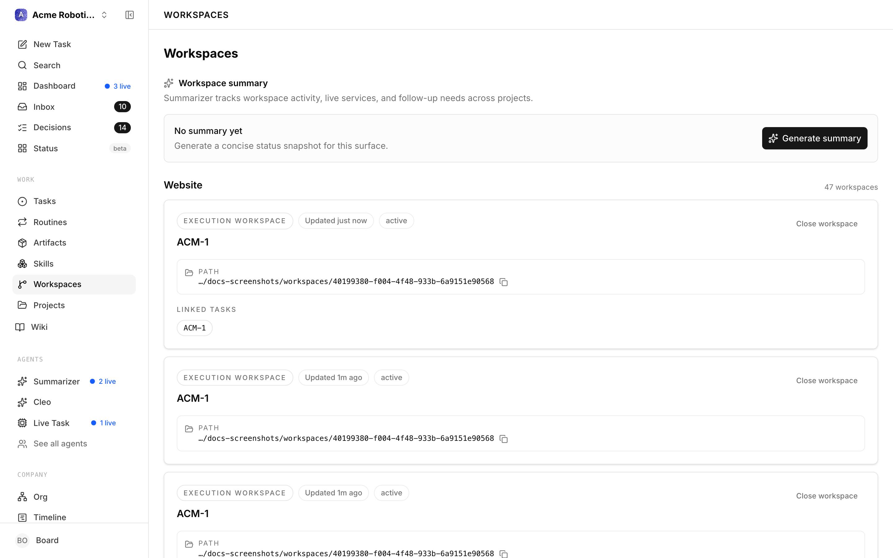

# Isolated Workspaces

By default, every task run on a project works in the project's primary checkout — one shared working tree. **Isolated workspaces** give a task run its own checkout instead: a git worktree on its own branch, so several agents can work on the same project at the same time without stepping on each other's files.

## Why it exists

A shared checkout is a bottleneck and a hazard: two concurrent runs editing the same tree corrupt each other's work, and a half-finished experiment sits in the primary checkout until someone cleans it up. Isolated workspaces make concurrency safe — each run gets its own branch, folder, and runtime context, provisioned and torn down by policy.

## Turn it on

1. Go to **Settings → Instance settings → Experimental**.
2. Turn on **Enable Isolated Workspaces** — *"Show execution workspace controls in project configuration and allow isolated workspace behavior for new and existing task runs."*

This is the single switch for all the workspace UI: the **Workspaces** sidebar item, the per-project **Execution Workspaces** configuration, the workspace-mode picker on new and existing tasks, and the project **Workspaces** tab.

> **Note:** unlike most experimental flags, this one is enforced at run time too. With the flag off, per-task workspace settings are ignored and runs stay on the primary checkout — turning it off is a real kill switch, not just hidden UI.

## Using it

The instance flag alone doesn't isolate anything — each project opts in:

1. Open a project's **configuration** and find **Execution Workspaces**.
2. Turn on **Enable isolated task checkouts** — *"Let tasks choose between the project's primary checkout and an isolated execution workspace."*
3. Optionally turn on **New tasks default to isolated checkout**, and open **Show advanced checkout settings** for the git details: base ref (`origin/main`), branch template (`{{issue.identifier}}-{{slug}}`), worktree parent dir (`.paperclip/worktrees`), and provision/teardown commands.
4. From then on, the new-task dialog (and each task's workspace card) offers a mode choice: the shared checkout, a **new isolated workspace**, or reuse of an existing one.
5. Browse live workspaces from the **Workspaces** sidebar page or the project's **Workspaces** tab — each workspace has a detail screen with its issues, runtime services, and logs.

The full tour of the workspace detail screen — tabs, runtime controls, logs — is in the [Workspaces guide](../guides/projects-workflow/workspaces.md).

## When it's off

The Workspaces sidebar item disappears (visiting `/workspaces` redirects to your issues), project and task workspace controls are hidden, and — because of the run-time enforcement above — runs execute on the primary checkout even for tasks that previously had isolated settings. Project policies and per-task settings are kept in the database and come back when you re-enable.

## Caveats

- Isolation requires **both** the instance flag and the project's *Enable isolated task checkouts* policy.
- Git worktree is the only implementation — the UI labels it *"Host-managed implementation: Git worktree."*
- The advanced **Environment** dropdown in the same section needs the [Environments](environments.md) flag and more than one selectable environment.

## Where to go next

- [Workspaces](../guides/projects-workflow/workspaces.md) — the full guide to execution workspaces and the workspace detail screen.
- [Projects](../guides/projects-workflow/projects.md) — project configuration in general.
- [Experimental features overview](overview.md)
