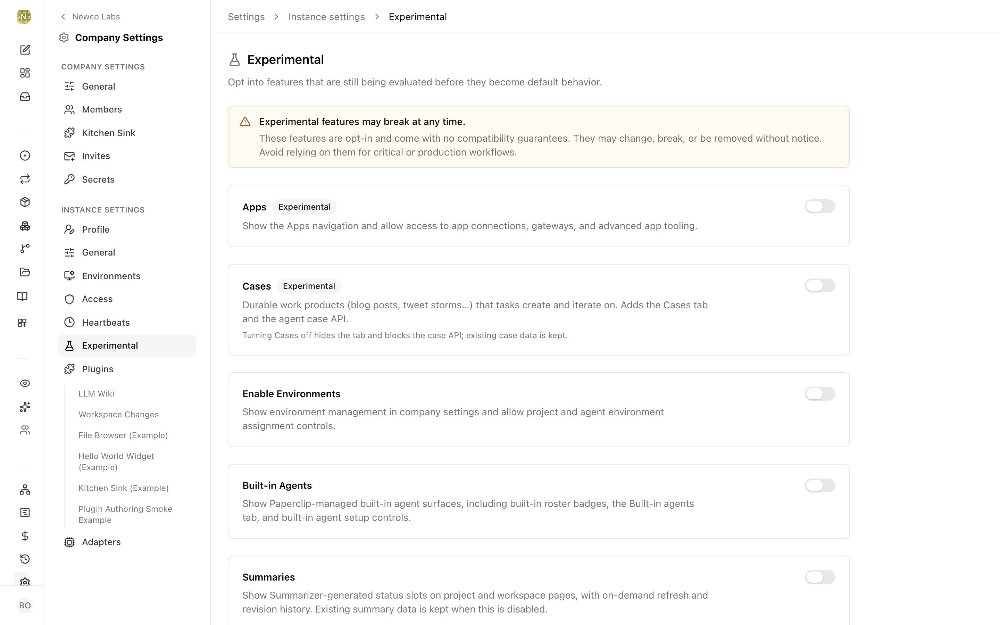

# Experimental features

Paperclip ships some features behind opt-in flags before they become default behavior. They're real, working features — you can turn them on today — but they're still being evaluated against real usage, so they live on a dedicated **Experimental** settings page instead of being on for everyone.

This section has one page per experimental feature: why it exists, how to turn it on, and how to use it.

## What "experimental" means

An experimental feature in Paperclip:

- **Has shipped and works.** These aren't stubs — each flag gates a complete surface.
- **Is opt-in.** Everything stays hidden until you flip the flag, so the UI stays out of your way if you don't use it.
- **Comes with no compatibility guarantees.** The app puts it plainly when you open the page: *"Experimental features may break at any time. These features are opt-in and come with no compatibility guarantees. They may change, break, or be removed without notice. Avoid relying on them for critical or production workflows."*

Turning a flag on is not dangerous in the "this will corrupt your data" sense, and flipping one back off is always safe — features are hidden, not deleted, and any data they created is kept. But don't build a workflow that has to stay stable on top of one, and expect to re-read the release notes after an upgrade: experimental features may be renamed, reworked, promoted to core settings, or retired between releases.

## Turning a feature on

All experimental flags live in one place, and they're instance-wide (they apply to every company on your Paperclip instance):

1. Open **Settings → Instance settings → Experimental**.
2. Find the feature's card and flip its toggle.

Changes take effect immediately — no restart, no migration. Each feature page in this section repeats the exact toggle name to look for.

## The features

| Feature | What it adds |
| --- | --- |
| [Environments](environments.md) | Environment management in settings, plus project and agent environment assignment — including custom sandbox images. |
| [Isolated Workspaces](isolated-workspaces.md) | Execution-workspace controls: per-run isolated copies of a project so agents don't step on each other. |
| [Experimental File Viewer](file-viewer.md) | Task-detail controls for browsing and previewing workspace files relative to a task. |
| [External Objects](external-objects.md) | Detects external URLs in issues and shows live status for referenced pull requests, tickets, and other work objects. |
| [Task Plan Decomposition Panel](plan-decomposition-panel.md) | Shows accepted-plan decomposition history on task detail pages. |
| [Task Watchdogs](task-watchdogs.md) | Watchdog agents that verify stopped task subtrees and restore live paths when work should continue. |
| [Cloud Sync](cloud-sync.md) | Connect a local instance to a Paperclip Cloud upstream: preview, push, retry, and activation review. |
| [Server Info Debug View](server-info-debug-view.md) | A "Server" section in the account drawer with the server restart time and running commit. |
| [Auto-Restart Dev Server When Idle](auto-restart-dev-server.md) | For Paperclip developers: restarts a stale `pnpm dev:once` boot once all local runs finish. |
| [Auto-Create Recovery Tasks](auto-create-recovery-tasks.md) | Lets the scheduler create recovery tasks for stalled task dependency chains. |

## Where to go next

- [Instance settings](../administration/settings.md) — the rest of the instance-level settings pages, including where the Experimental page sits.
