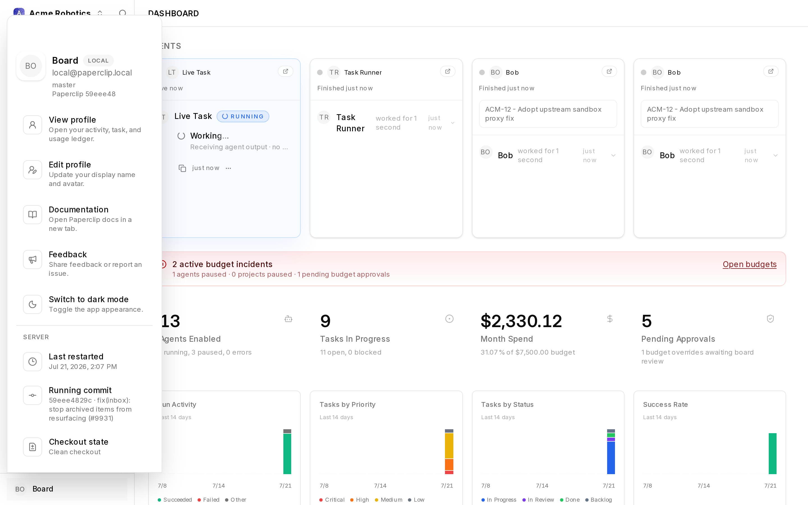

# Server Info Debug View

"Which commit is this server actually running?" is the first question in a lot of support and development conversations. The **Server Info Debug View** answers it from inside the app: it adds a **Server** section to the account drawer showing when the server last restarted, the running commit, and whether the checkout has local changes.

## Turn it on

1. Go to **Settings → Instance settings → Experimental**.
2. Turn on **Server Info Debug View** — *"Show a 'Server' section in the account drawer with the current server restart time and running commit."*

## Using it

Click your avatar at the bottom of the sidebar to open the account drawer. Below **Sign out**, the **Server** section shows three rows:

- **Last restarted** — the dev-server restart time when available, otherwise the process start time.
- **Running commit** — short SHA and commit subject (or *"Commit unavailable"* on deployments without git metadata).
- **Checkout state** — *"Clean checkout"* or *"Local changes present (N staged, N unstaged, N untracked)"*.

The values refetch every time you open the drawer, so a restart shows up immediately. On a dev-server instance (`pnpm dev:once`) the section also live-polls every couple of seconds while the drawer is open.

## Why it exists

It's a lightweight triage aid, most useful on local and development instances: confirm at a glance that a restart picked up your changes, that the server is on the commit you think it is, and whether the checkout is dirty — without shelling into the box. It pairs naturally with [Auto-Restart Dev Server When Idle](auto-restart-dev-server.md).

## When it's off

The section simply isn't rendered and no polling happens. There's no stored data involved either way.

## Where to go next

- [Auto-Restart Dev Server When Idle](auto-restart-dev-server.md) — the companion flag for keeping a dev boot fresh.
- [Experimental features overview](overview.md)
