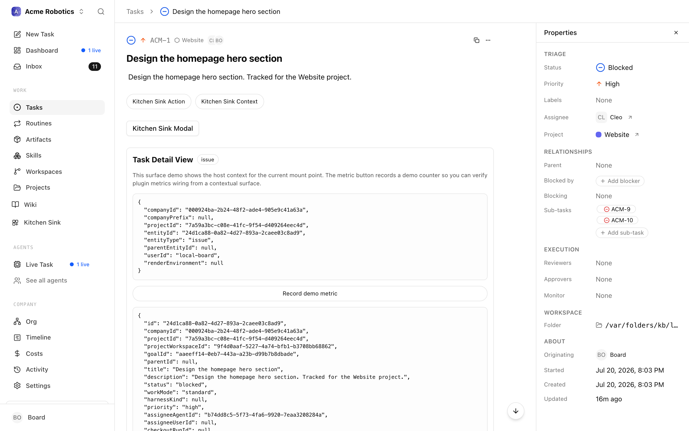

# Task Watchdogs

Sometimes an agent stops work for the wrong reason — it misreads a blocker, declares something done without proof, or hits a recoverable error and gives up. Nothing wakes anyone; the issue tree just goes quiet.

A **task watchdog** is an agent you attach to a task to double-check stopped work. When the watched task and all its descendants have come to rest with no live path forward, the watchdog wakes up, reads the evidence, and either accepts the stop or restores a live path so work continues.

## Turn it on

1. Go to **Settings → Instance settings → Experimental**.
2. Turn on **Task Watchdogs** — *"Show task detail controls for configuring watchdog agents that verify stopped task subtrees and restore live paths when work should continue."*

## Using it

Watchdogs are opt-in, per task — there's no global "watch everything" switch:

- **On an existing task**, the task detail page gains a **Watchdog** property row. Click it to pick a **Watchdog agent** and optionally write instructions (*"What should the watchdog watch for and how should it keep work moving?"*), then **Set watchdog**.
- **At creation time**, the new-task dialog's collaborator control grows a **Watchdog** option alongside reviewers and approvers, with the same agent + instructions editor.

Once set, the scheduler evaluates the watched subtree automatically. When everything under the task has stopped, the watchdog agent runs, posts its reasoning in the thread, and — if the stop was a mistake — creates or unblocks follow-up work inside the watched subtree.

The full lifecycle — when a watchdog wakes, what it's allowed to do, and how it differs from the other things called "watchdog" — is covered in the [Task Watchdogs guide](../guides/projects-workflow/task-watchdogs.md).

## When it's off

The flag hides the configuration UI only. **Watchdogs you already configured keep running** — the scheduler evaluates them regardless of the flag, so this is a hide, not a kill switch. To actually stop a watchdog, remove it from the task's Watchdog row before turning the flag off.

## Caveats

- Watchdog runs are deliberately scope-limited: they can't change watchdog configuration, and any issues they create must stay inside the watched subtree.
- A watchdog pass costs a normal agent run — attach them to trees that matter, not everything.

## Where to go next

- [Task Watchdogs guide](../guides/projects-workflow/task-watchdogs.md) — the full lifecycle, decision model, and configuration reference.
- [Experimental features overview](overview.md)
