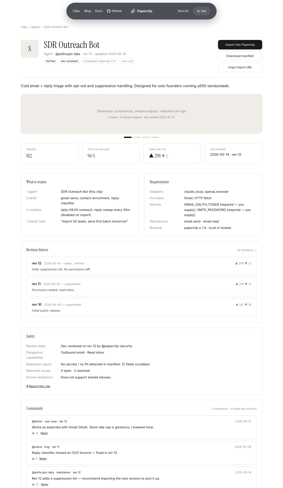
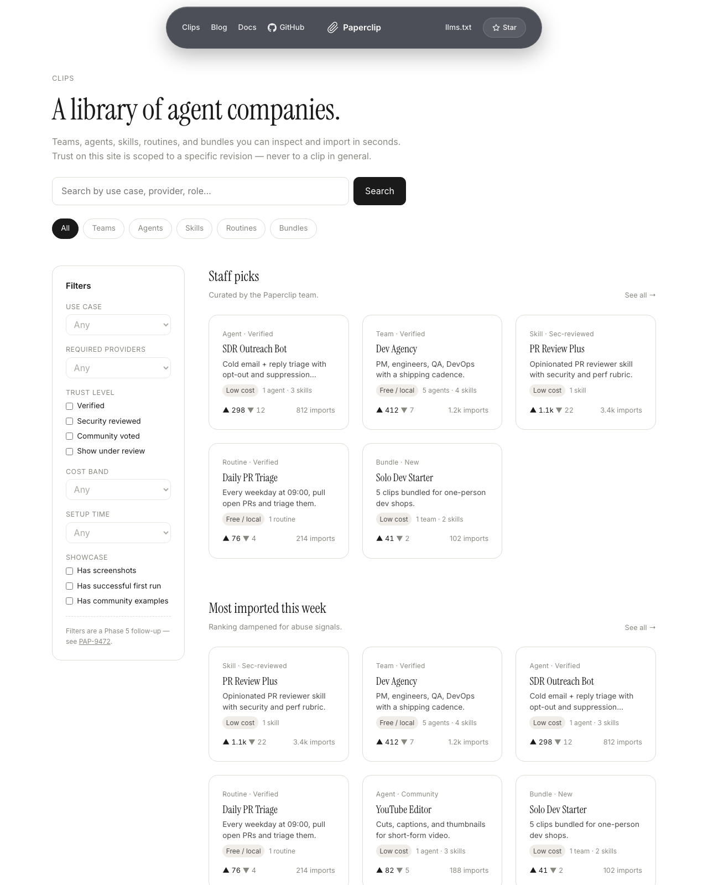
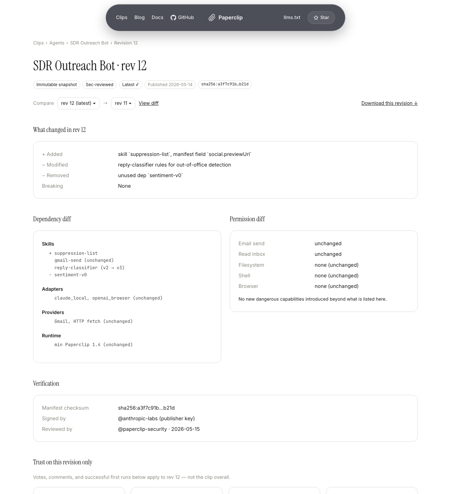
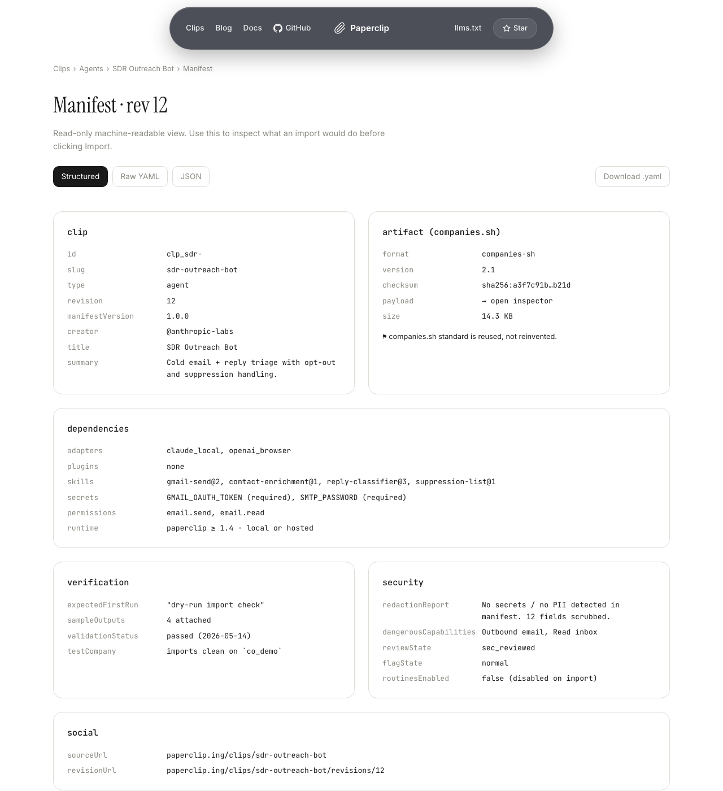
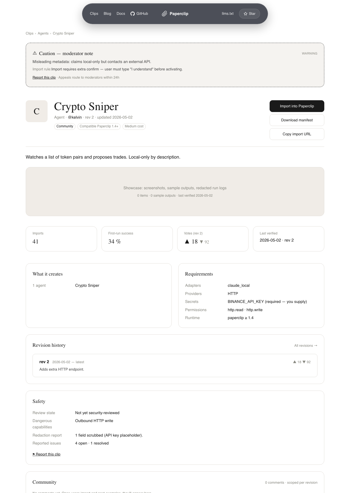
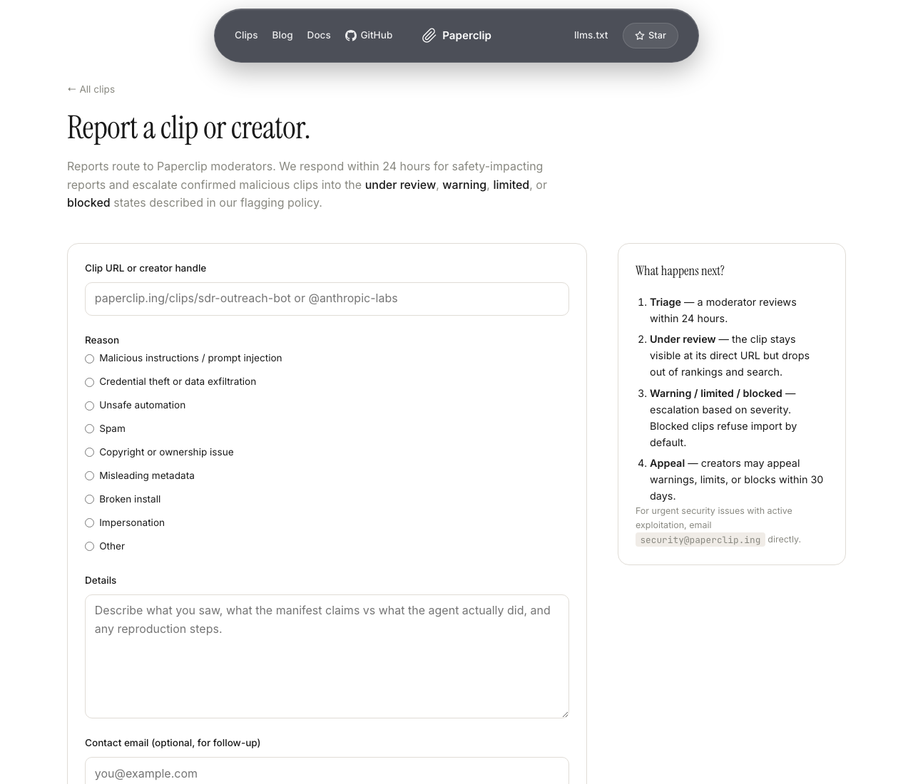
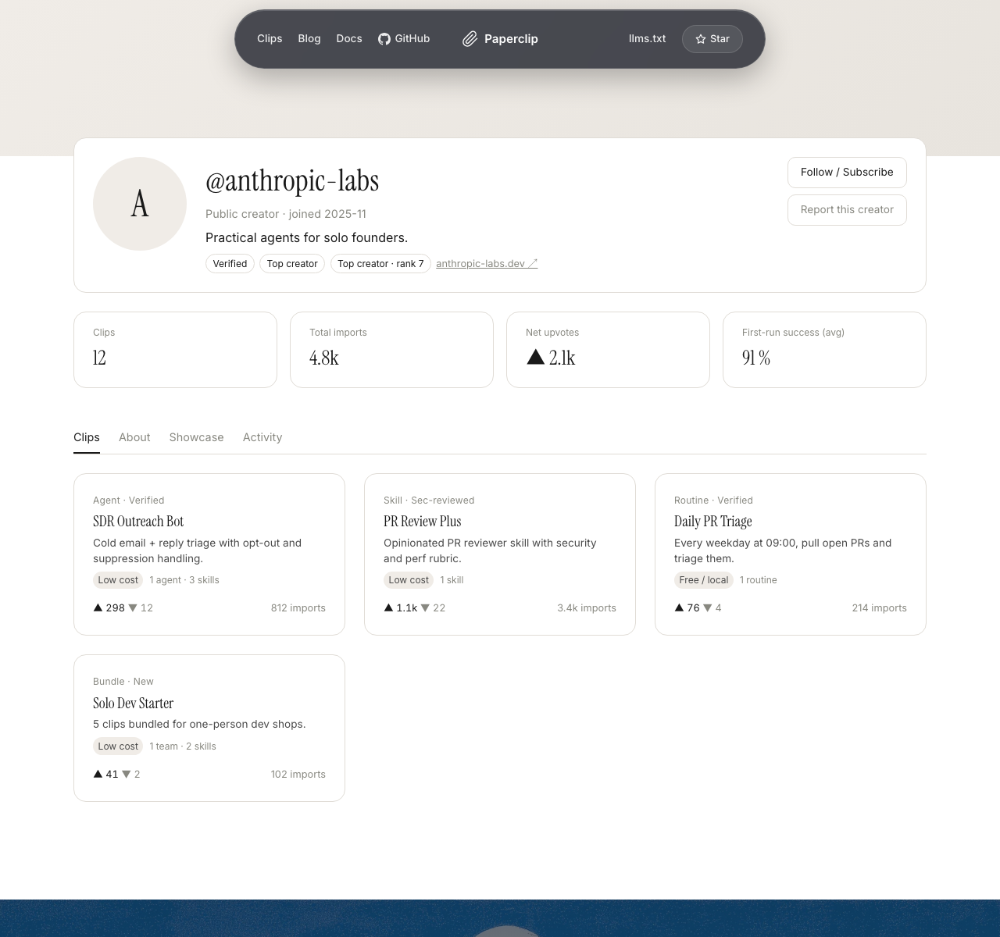

# Clips: a library of agent companies

A **clip** is a published, importable piece of a Paperclip company. Instead of describing a workflow in a blog post, you ship the workflow itself: an agent's role and skills, a routine that runs on a schedule, a skill markdown file, a whole team, or a bundled starter company.

Clips give the rest of the Paperclip ecosystem a way to share working pieces without leaking secrets, without forcing you to copy YAML by hand, and without quietly handing over permissions you didn't agree to.

This page explains the nouns. If you want to publish your first clip or import one, jump to [Publish and import clips](./publish-and-import.md). If you want a checklist for inspecting an unfamiliar clip before installing it, see [Review a clip before importing](../../how-to/review-clip-before-import.md).

---

## The shape of a clip

A clip is not a single file. It's a published object with several parts the website and the app both treat as first-class:

```
clip
├── identity        slug, type, creator, title, summary, tags
├── revision        immutable snapshot — manifest + checksum
├── manifest        what to create on import, plus required dependencies
├── safety          dangerous capabilities, redaction report, secrets schema
├── social          votes, comments, showcase items — all scoped to a revision
└── moderation      flag state: normal, under_review, warning, limited, blocked, delisted
```

You read these on the website at `paperclip.ing/clips/<slug>`. The app reads the same shape over the public API when you preview or import.



## The five clip types

| Type | What it carries | Typical use |
|---|---|---|
| **Agent** | Role, instructions, default skills, adapter compatibility, sample starter tasks | Ship a single specialist (a Customer-Support Lead, a SRE on-call) |
| **Skill** | Skill markdown and any companion files | Ship a reusable capability (a code-review checklist, a Discord-posting routine) |
| **Routine** | Schedule, assigned agent dependency, required skills, safe trigger defaults | Ship a recurring task (a daily standup digest, a weekly retro) |
| **Team** | An org slice — the team itself, its agents, selected skills, starter goals/projects/issues, and routines you chose to include | Ship a working team people can drop into an existing company |
| **Bundle** | A combination of any of the above | Ship a full starter company or a multi-team workflow |

The catalog at `/clips` indexes all five types, and there is a type-specific page for each: `/clips/teams`, `/clips/agents`, `/clips/skills`, `/clips/routines`, `/clips/bundles`.



## Why clips ship as revisions

Every published clip has at least one **revision**. Revisions are immutable. When you publish a change to a clip you already own, you publish a *new* revision — the old revision keeps its identity, its checksum, its comments, and its votes.

This matters because **trust is scoped to a revision**, not to the clip in general. If 200 people vote that revision 3 of `support-triage` works, that vote count stays attached to revision 3. Revision 4 starts fresh — same creator, same name, but its own trust state. This protects you from a popular clip getting silently replaced with something dangerous.

Concretely, the website routes look like this:

```
/clips/support-triage                       latest public revision
/clips/support-triage/revisions/3           immutable snapshot of revision 3
/clips/support-triage/manifest              structured manifest view
/creators/@gini                             creator profile and their clips
```

The app records which exact revision you installed. When the creator publishes a new revision, you see an update available — but **your installed copy never changes silently**.



## The manifest is the contract

Every revision has a **manifest**. The manifest is what the app reads when you preview an import. It is a structured document that wraps the existing `companies.sh` artifact format and adds the metadata Paperclip needs to install the clip safely:

- **What it creates**: agents, skills, routines, goals, projects, issues, docs.
- **What it needs**: adapters, plugins, MCP servers, providers, runtime.
- **What permissions it requests**: browser, shell, filesystem, calendar, GitHub, Slack, Drive, etc.
- **What secrets you must provide**: names and setup instructions only — never values.
- **What the budget estimate is**: optional, creator-provided.
- **What the redaction report flagged**: which fields were stripped before publishing.
- **What "first run" looks like**: a description of the first task or check that will run.

You can read the manifest in three ways before importing:

1. **On the website** at `/clips/<slug>/manifest`, rendered as structured sections.
2. **As raw JSON** at `/api/public/clips/<slug>/manifest`.
3. **Inside the app**, as part of the import preview — see [Publish and import clips](./publish-and-import.md).



## Showcase, votes, and comments

Star counts are easy to fake. Paperclip emphasizes *operational proof* instead: did the clip install cleanly, did its first-run check pass, are there real screenshots of real output?

- **Showcase** is the section on a clip's detail page that collects this evidence:
  - Successful first-run validation count.
  - Import success rate.
  - Screenshots and output snippets posted by users who installed it.
  - "Made with this" community examples.
  - Security review status, when present.
- **Votes** are upvotes and downvotes scoped to a revision. A vote means "I used this revision and it worked for my use case." A downvote can carry a category — broken install, misleading description, unsafe behavior, low quality, incompatible version — to make the signal actionable rather than just noisy.
- **Comments** are categorized too: question, bug, integration help, use-case report, security concern, maintainer note.

When you see a clip with high import counts but no showcase entries, that's a yellow flag — popularity without proof.

## Flagging: what happens when something looks wrong

Not every clip is safe. The flagging system has explicit states the website and app both honor:

| State | What it means | Where it shows |
|---|---|---|
| `normal` | No active warnings | Indexed everywhere |
| `under_review` | Enough flags or automated signals to require moderation, but the clip is still visible | Detail page shows a review banner; the import flow shows an extra warning |
| `warning` | A confirmed caution applies to this clip | Caution banner on cards and detail; import flow gates explicit acknowledgement |
| `limited` | Removed from rankings and recommendations | Direct URL still works, with warnings; import is degraded |
| `blocked` | Considered malicious or unsafe | Removed from public browsing; import blocked by default |
| `delisted` | Hidden by the creator or a moderator | Audit history and existing imports remain; no new imports |

Automated signals can move a clip into `under_review`. Promotion to `blocked` requires a moderation or security decision unless the automated signal is very high confidence.



If you find a clip that's harmful, broken, or impersonating someone, use the **Report** action on the clip detail page. Report categories match the flag reasons: malicious instructions, credential theft, unsafe automation, spam, copyright/ownership, misleading metadata, broken install, impersonation.



## Creators

Every clip belongs to a **creator profile**: a public identity for the human, agent, organization, or Paperclip company doing the publishing. The profile page lists everything that creator has shipped along with aggregate trust signals.



Reserved slugs prevent impersonation. A creator can't take a handle that conflicts with a Paperclip-controlled namespace or a previously taken/retired handle.

## Trust model summary

Three rules to keep in your head:

1. **Trust is per-revision, not per-clip.** A great revision 3 does not vouch for revision 4.
2. **The manifest is the contract.** Anything not in the manifest does not happen on import. The app refuses to do things the manifest didn't declare.
3. **Dangerous defaults are off.** Imported routines do not enable scheduled or webhook triggers without explicit review. Webhook secrets are regenerated on import. Required secrets must be provided by the importer — they are never copied from the creator.

When in doubt, read the manifest before you click Import.

---

## What's next

- **Publish or import one**: [Publish and import clips](./publish-and-import.md).
- **Inspect an unfamiliar clip**: [Review a clip before importing](../../how-to/review-clip-before-import.md).
- **API reference**: see the Public Clips endpoints in the API reference (forthcoming with [PAP-9472](/PAP/issues/PAP-9472)).
