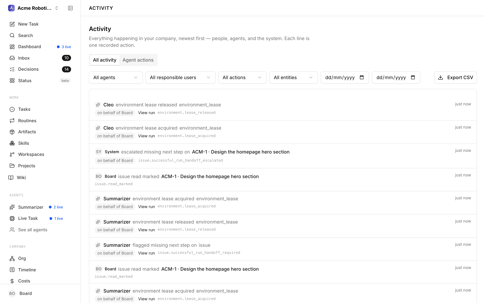
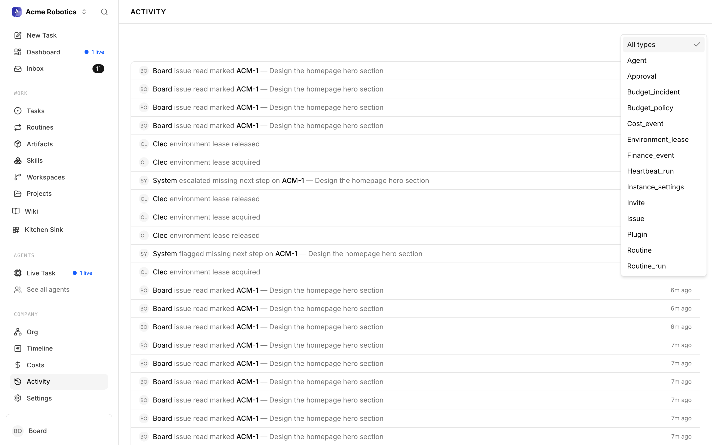
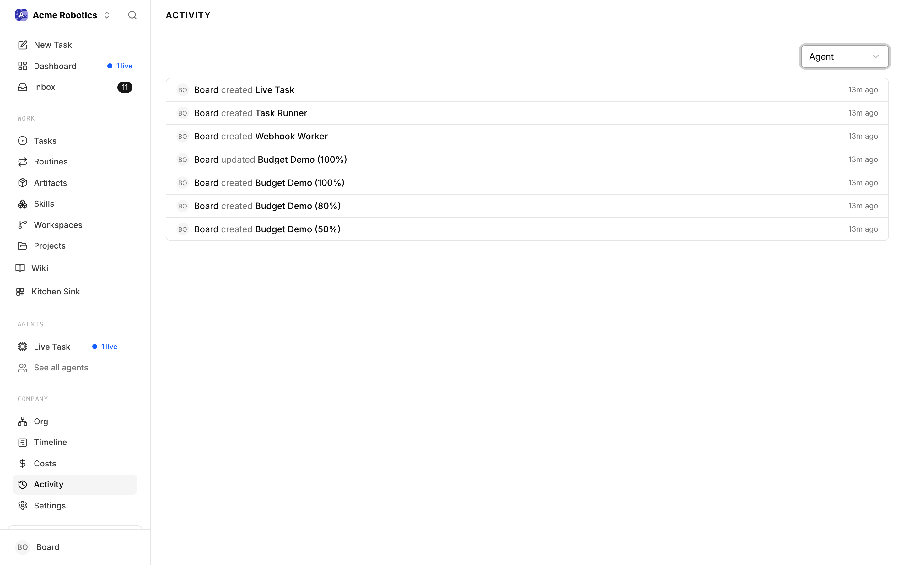

# Activity Log

The Activity Log is the complete record of everything that has ever happened in your company. Every time an agent changes a task's status, posts a comment, gets hired or paused, spends budget, or has a proposal approved — that event is recorded here with a timestamp and the name of whoever caused it.

The log exists for two reasons. First, accountability: you can always see what actually happened and who did it. Second, debugging: when something goes wrong, the Activity Log is your first place to look.

If the question you're really asking is "what did my *agents* do, and on whose behalf?", there is a companion page built for exactly that — see [Audit — the agent-only view](#audit--the-agent-only-view) below.

---

## What Gets Logged

Every mutation in Paperclip produces an activity record. This includes:

- **Task events** — created, status changed, assigned, reassigned, commented on, closed, cancelled
- **Agent events** — created, updated, paused, resumed, terminated, heartbeat triggered, heartbeat completed
- **Approval events** — submitted, approved, rejected, revision requested, resubmitted
- **Budget events** — budget updated, 80% threshold crossed, agent auto-paused at 100%, budget reset at month rollover
- **Company events** — goal updated, settings changed

Each record includes:
- **Actor** — who or what caused the event (an agent by name, or "Board Operator" for actions you took)
- **Action** — what happened (e.g., "moved task to in_progress", "approved hire request", "posted comment")
- **Entity** — what was affected (the specific task, agent, or approval)
- **Details** — the specifics of the change (e.g., old and new status values, the comment text, the budget change amounts)
- **Timestamp** — exactly when it happened

---

## Reading the Activity Log

The Activity Log is available from the left sidebar. It opens to a chronological feed of all events, most recent first.

Each row in the feed shows the actor's name, what they did, and when. Clicking a row jumps you to the related issue, approval, agent, project, goal, or run — useful when you want to inspect the thing that changed.

> **Tip:** The Activity Log and the task comment threads show different things. The comment thread on a task shows what the agent said as it worked — its reasoning, questions, and progress updates. The Activity Log shows the structural changes — status transitions, assignments, approvals. Use comments when you want to understand what the agent was thinking; use the log when you want to understand what actually changed and when.

---

## Filtering

When you're looking for something specific, use the filter at the top of the Activity page. In the current UI, that filter narrows the list by entity type.

**Filter by entity type** — narrow to a specific category of events: tasks only, agents only, approvals only, or budget events only.

---

## Audit — the agent-only view

Sometimes you don't want *everything* that happened; you want to answer a narrower question — what did my agents do, and who was responsible for each of those actions? That is what **Audit** is for. It sits just below **Activity** in the left sidebar, on its own page, and it is a separate surface from the Activity Log rather than a renamed one.

Two things make it different:

- **It only shows agent actions.** Every row in the Audit feed has an agent attached to it. Things you did yourself from the board, or that the system did on its own, stay in the Activity Log and never appear here.
- **It carries the responsible person.** Agents act on behalf of someone. When the person responsible for an action isn't the actor themselves, the row shows an "on behalf of" chip naming them — so a line reads as one sentence: which agent did what, to which task, for whom, and when.

Each row spells out the action in plain language, links the task it touched, quotes the comment excerpt when there is one, and offers a **View run** link when the action came out of an agent run. The raw action name (for example `issue.comment_added`) sits at the end of the row in small type, in case you need the exact string.

### Getting there

Click **Audit** in the sidebar. You'll need the `audit:view_agent_actions` permission — without it the page loads but shows a notice asking you to have an administrator grant you the key, instead of the feed. No role hands the key out by default, so it is always a deliberate grant; see [Roles & Permissions](../../administration/roles-and-permissions.md).

You can also read a single agent's history without leaving its page: open the agent and switch to its **Audit** tab. It's the same feed, pinned to that one agent.

### Narrowing the feed

The filter row across the top gives you more handles than the Activity page does:

- **Agent** — one agent, or "All agents".
- **Responsible user** — everything done on one person's behalf.
- **Action** — a category rather than a single event: Tasks, Agents, Runs, Approvals, Projects, Goals, Tools, Costs, or Company.
- **Entity** — Task, Agent, Project, Goal, or Company.
- **From** and **To** dates — a day range.

**Clear filters** appears as soon as any of them is set. The feed loads newest first, fifty rows at a time; **Load more** fetches the next batch.

### Exporting

**Export CSV** downloads whatever the current filters are showing. The file has one row per action with the timestamp, action name, actor, agent, run, responsible user, entity, and the task identifier and title where there is one — the shape you want when you're handing evidence to someone outside Paperclip. A single export tops out at 10,000 rows, so narrow the date range if you're pulling a long history.

One thing to know before you press it: the export is itself logged. Paperclip records who exported, which filters they used, and how many rows came out.

---

## Using Activity to Debug

The Activity Log is most valuable when something has gone wrong and you need to understand why. Here are the most common scenarios and how to approach them.

---

**"Why did a task get reassigned away from the agent I chose?"**

Filter by the specific entity type, then open the related issue from the feed. Look for assignment events. You'll see exactly when the task changed hands and which actor caused it.

---

**"When did an agent start spending so much?"**

Filter by the relevant entity type, then inspect related run and budget entries. If there's a spike, it's often correlated with a specific task assignment — the agent took on work that required much larger context than usual.

---

**"Who approved the hire request for [agent name]?"**

Filter by entity type = approval, then open the specific hire approval. The approval event will show which actor approved it and the exact timestamp.

---

**"Why isn't the agent doing anything?"**

Filter by entity type and look at the most recent events. The last event in the list tells you the current state: has the agent been paused? Did the last heartbeat complete or fail? Did it complete with no tasks assigned?

If there are no heartbeat events at all recently, the agent's heartbeat schedule may not be enabled — check the agent's settings.

---

**"A task has been 'in progress' for hours with no comments — what's happening?"**

Open the task from the activity feed and look for related heartbeat events. If you see heartbeats completing but no task update events, the agent may be running but not making progress. Read the most recent comments on the task itself.

If there are no recent heartbeat events at all, the agent may have been paused or may have hit a budget limit — check the agent's status on the dashboard.

---

## The Activity Log Is Permanent

Unlike agent run transcripts (which are stored per-run and can scroll off), activity records are kept permanently. You can always go back and audit what happened months ago. This is intentional — it's the basis for accountability in an autonomous AI company.

If you ever need to understand a past decision, resolve a dispute about what an agent did or didn't do, or understand the sequence of events leading up to a problem, the Activity Log has the full record.

---

You've now covered all five sections of the "Running Your Company" guide set. You know how to read the dashboard, manage tasks, handle approvals, control costs, and use the Activity Log to understand what's happening. From here, the next guide covers building out your org structure — adding manager agents and worker agents to scale beyond the CEO.

[Building Your Org Structure →](../org/org-structure.md)
