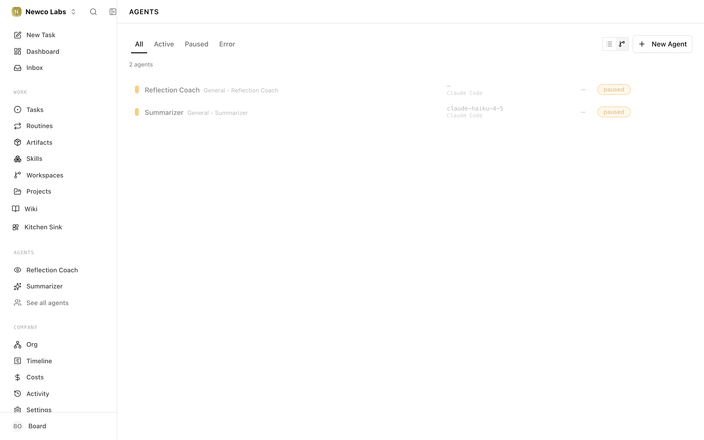
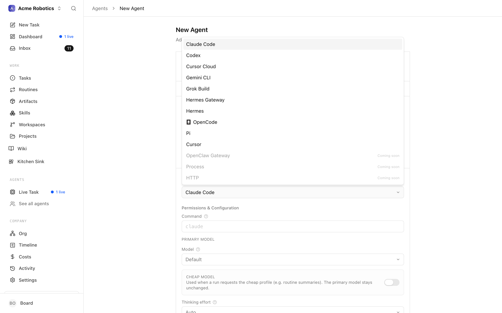
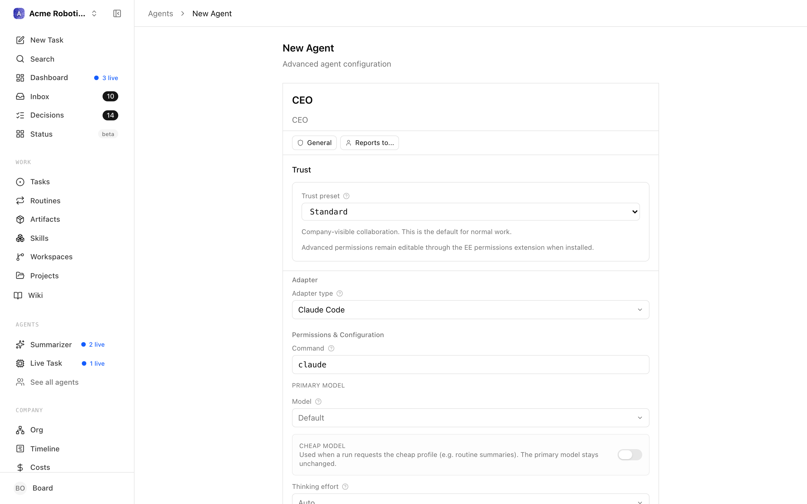
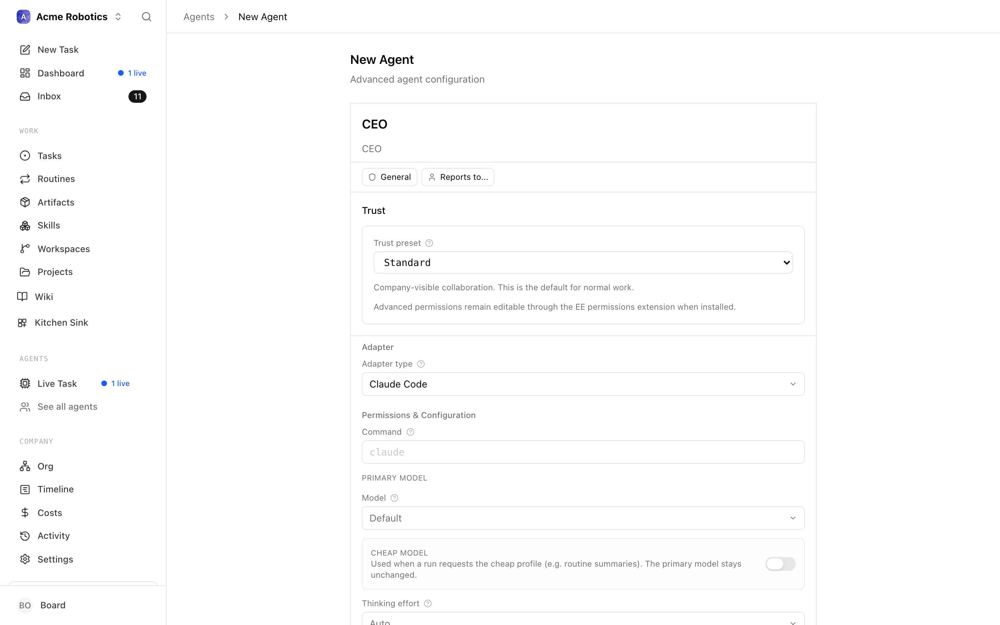
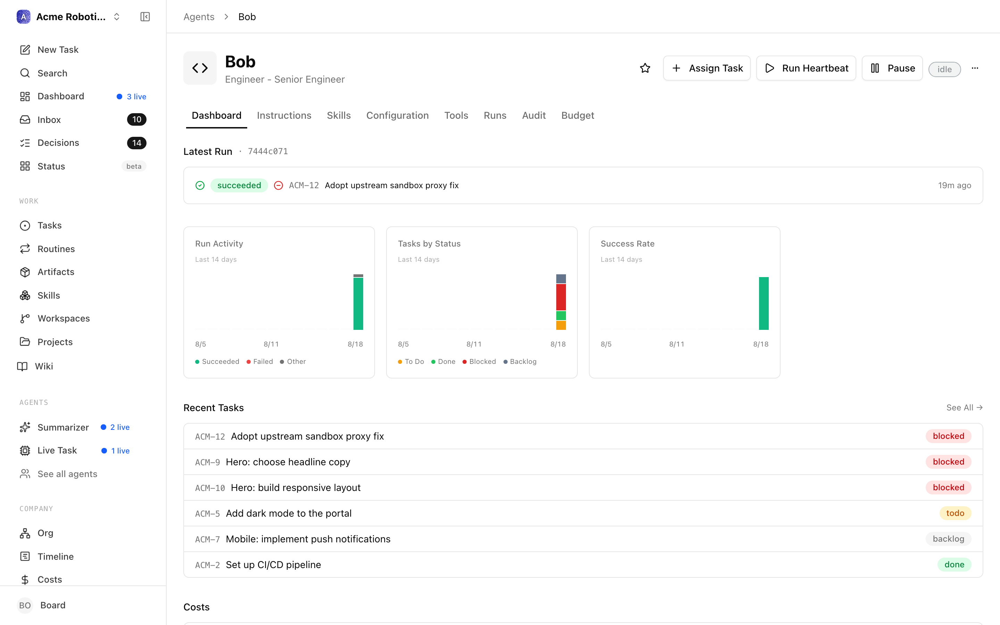
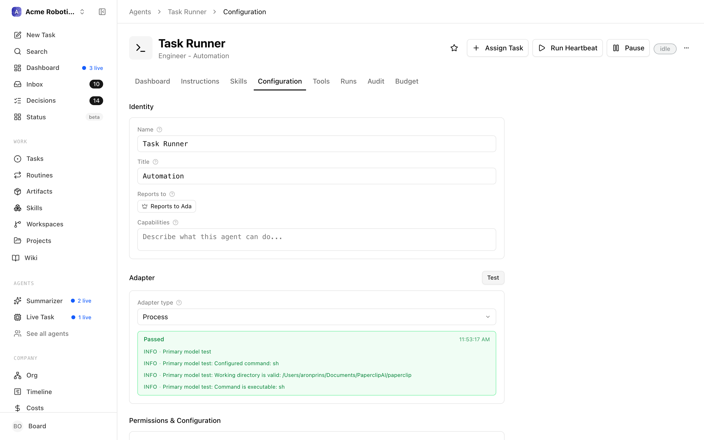
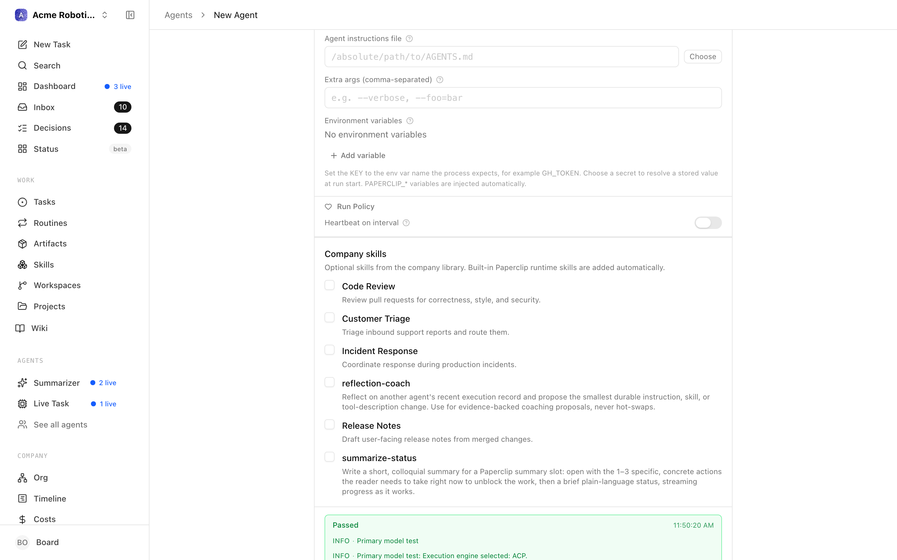

# Hire Your First Agent

An agent isn't just "an AI". It's a configuration — a specific role, with a specific AI system powering it, operating under a specific budget, with defined rules for when and how it wakes up and works.

When you hire an agent, you're telling Paperclip: which AI system should run this agent, what role does it play in the company, and what constraints does it operate within. The AI itself (Claude, Codex, etc.) lives outside Paperclip. Paperclip is the management layer above it.

Your **first agent — the team lead — is already created for you during onboarding.** The [Create Your First Company](./your-first-company.md) wizard walks you through naming it, connecting a model, and bringing it online, so by the time you reach this page you already have one agent up and running. This guide is about the next step: **hiring additional agents** to grow your team, and understanding the settings you can tune on any agent afterward.

Everything below applies to your existing lead agent too — the adapter, model, environment, budget, and heartbeat settings are the same whether you're configuring your first agent or your fifth.

---

## Before you start

You'll need:
- A company already created, with its first agent brought online through the wizard (see [Create Your First Company](./your-first-company.md))
- An API key from Anthropic (for the `claude_local` adapter) or OpenAI (for `codex_local`) — see the [Installation guide](./installation.md) for how to get one
- **For `claude_local`:** [Claude Code](https://docs.anthropic.com/en/docs/claude-code) installed on your Mac

---

1. **Open the Agents page and click "New Agent"**

   In the sidebar, click **Agents**. You'll see your existing lead agent listed here. To grow the team, click **New Agent**.

   

2. **Set the agent's name and role**

   Give the agent a name that describes what it does (e.g. "Content Writer" or "QA Engineer").

   

   Each agent you hire here has a **Reports To** field, where you (or your lead agent) assign a manager. This is how the org chart forms: your lead agent sits at the top, and the agents you add report up to it or to each other. Your very first agent — the one created during onboarding — is the exception, because it reports directly to the board (to you).

3. **Choose an adapter**

   An adapter tells Paperclip how to run your agent. Click the **Adapter Type** dropdown to see your options.

   

   <!-- tabs: Claude Code (Recommended), Codex -->

   <!-- tab: Claude Code (Recommended) -->

   **Claude Code** runs a Claude Code agent directly on your Mac. The agent has full access to your filesystem in its working directory, can run terminal commands, write and edit files, and call the Claude API on your behalf.

   This is the most capable and most commonly used adapter for Paperclip agents.

   **Prerequisites:** Claude Code must be installed on your Mac. If you haven't installed it, follow the [Claude Code installation guide](https://docs.anthropic.com/en/docs/claude-code) — it's a separate Anthropic product. Come back here once it's installed.

   **Configuration fields:**

   

   - **Working directory** — The folder on your Mac where the agent will do its work. This is where files get created, edited, and read. If you're not sure what to use, create a folder called `paperclip-workspace` on your Desktop and paste that path here (e.g. `/Users/yourname/Desktop/paperclip-workspace`).

   - **Model** — Which Claude model powers this agent. `claude-opus-4-6` is the most capable and best for strategic roles like the CEO. `claude-sonnet-4-6` is faster and cheaper, and works well for more routine tasks.

   - **Environment variables** — Add `ANTHROPIC_API_KEY` and either paste the key as a plain value or store it as a Paperclip secret. This is how the adapter gets access to Claude.

   - **Test environment** — Use this button to confirm Paperclip can see Claude Code and that your `ANTHROPIC_API_KEY` binding works before you create the agent.

   > **Tip:** If you're unsure about the working directory, create a new folder called `paperclip-workspace` on your Desktop. Use that path until you decide on a better home for your agents' work.

   <!-- tab: Codex -->

   **Codex** runs an OpenAI Codex agent directly on your Mac. Like `claude_local`, it has access to your filesystem and can run commands within its working directory — but it's powered by OpenAI's models rather than Anthropic's.

   **Prerequisites:** You'll need the OpenAI Codex CLI installed. Check the [OpenAI documentation](https://platform.openai.com) for installation instructions.

   **Configuration fields:**

   - **Working directory** — The folder on your Mac where the agent will do its work. Create a folder called `paperclip-workspace` on your Desktop if you don't have a preferred location.

   - **Model** — Which OpenAI model to use. `gpt-5.3-codex` is the default and a sensible starting point for a CEO agent.

   - **Environment variables** — Add `OPENAI_API_KEY` and either paste the key as a plain value or store it as a Paperclip secret.

   - **Test environment** — Use this button to verify the adapter can see your OpenAI key binding before you create the agent.

   <!-- /tabs -->

4. **Configure the heartbeat interval**

   The create form's run policy is deliberately simple: you can decide whether this agent runs on an interval, and how often.

   

   For most agents, once per hour is a reasonable starting cadence. You can make it faster later once the company is active and you have a feel for the cost.

   > **Tip:** Don't set the interval too short early on. Every heartbeat costs money. Once per hour is a good starting point. You can increase frequency later once you understand your company's rhythm.

5. **Create the agent**

   Click **Create agent**. Paperclip creates the agent and takes you to the agent detail page. You should see the agent with a status of **idle** — meaning it's configured and ready, but hasn't fired a heartbeat yet.

   

   The heartbeat is disabled by default when you first create an agent. You'll enable it in the next guide, once you're ready to let the agent start working.

6. **Set the budget after creation**

   Budgets are configured after the agent exists. Open the agent's **Budget** tab and set a monthly cap that fits the role.

   > **Warning:** More active agents — ones that run on every heartbeat and do more complex reasoning — need a higher cap than routine workers. A lead or strategic agent might warrant $30–50 per month, while a narrow worker can run on much less. You can always adjust this later.

   Remember: this agent budget is separate from the company budget. Both apply — if either limit is reached, the agent pauses.

7. **Test the environment again if needed**

   Before enabling the agent's heartbeat, you can verify that the adapter is configured correctly. On the agent detail page, click **Test environment**.

   Paperclip will attempt to connect to the adapter — in the case of `claude_local`, it will check that Claude Code is installed and accessible, and that the environment variable binding is valid.

   

   If the test succeeds, you're ready. If it fails:

   

   See the troubleshooting section below.

---

## Troubleshooting

**"Test Environment" fails**

The two most common causes:
- The environment variable binding is wrong — double-check that you've set `ANTHROPIC_API_KEY` or `OPENAI_API_KEY`, and that the value itself is correct with no extra spaces.
- Claude Code isn't installed, or isn't at the path Paperclip expects — confirm you can open Claude Code from your Mac independently of Paperclip.

**Agent shows "error" status after its first heartbeat**

Open the **Runs** tab on the agent detail page, then click the most recent run. You'll see a full transcript of what happened. Error messages in the transcript will point to what went wrong.

**Budget immediately shows near 100%**

This usually means the model name is invalid and the API is returning error responses that still count against usage, or the bound API key doesn't have available credits. Verify the model name matches exactly what your AI provider supports, and check your API provider's billing page to confirm your account has credit.

---

Your new agent is configured. The next guide covers enabling a heartbeat and watching a round of autonomous work unfold.

[Watching Agents Work →](./watching-agents-work.md)
