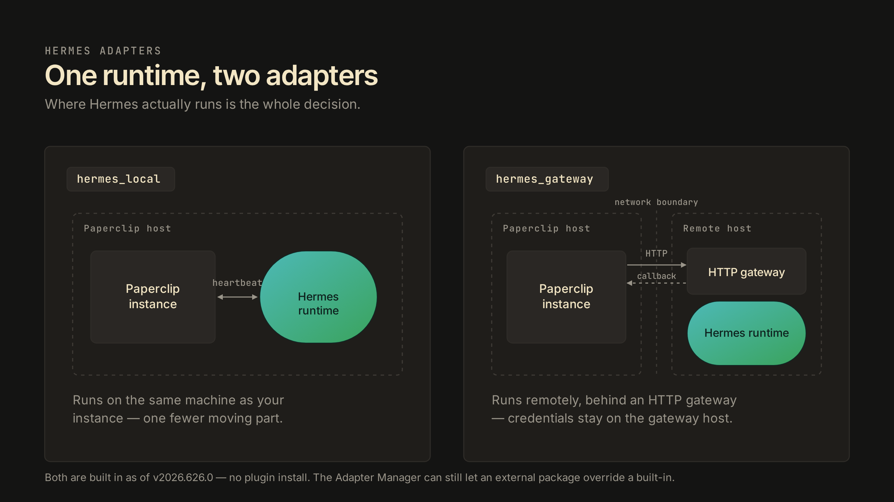
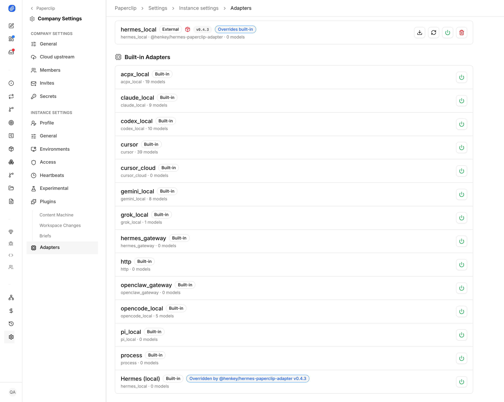

# Hermes adapters

Paperclip runs Hermes agents through two built-in adapters. `hermes_local` runs Hermes on the same machine as your Paperclip instance. `hermes_gateway` sends work to a Hermes install running somewhere else, behind an HTTP gateway. Both ship with Paperclip as of v2026.626.0, so hiring a Hermes agent no longer starts with a plugin install.

## Background

An adapter is Paperclip's integration layer for an agent runtime: it translates between the heartbeat system and whatever protocol the runtime speaks. This is the bring-your-own-agent design. Paperclip orchestrates; the runtime does the thinking; the adapter is the seam between them.

Until this release, Hermes support lived in an external adapter package. That worked, but it put an install and maintenance step in front of every fleet that wanted Hermes agents, and external packages have to be kept current by hand. Promoting Hermes to a built-in removes that step. The runtime did not change. What changed is who maintains the seam.

## The mental model

An adapter answers one question: when a heartbeat fires for this agent, where does Hermes actually run?

With `hermes_local`, the answer is "right here." The runtime executes on the host your Paperclip instance runs on, next to its files and its network.

With `hermes_gateway`, the answer is "wherever the gateway is." Paperclip makes an HTTP call to a gateway that fronts a Hermes install on another machine, another network, or another team's infrastructure. The heartbeat travels over the wire; the work happens remotely; results come back through the same seam.

One runtime, two placement decisions. Everything else about the agent (role, budget, tasks, governance) is identical between the two.

## How it behaves

Hiring works the same as any other adapter type: the two Hermes options appear in the adapter dropdown when you create or configure an agent.

`hermes_gateway` needs to know how to reach the gateway, so its configuration collects an API base URL and an API key. The key field is a password input, hidden by default. The config also takes a Paperclip API URL, which the remote Hermes uses to call back into your instance; set it to a URL that is reachable from the gateway's network rather than a localhost address. Timeout and reconnect settings exist but have workable defaults.

Built-ins coexist with external packages. The Adapter Manager page lists every adapter with its source, built-in or external. If you install an external Hermes package that declares the same adapter type, it shadows the built-in: the external entry shows an "Overrides built-in" badge, and the built-in shows which package overrides it. Removing or toggling the external package puts the built-in back in play. The override is visible and reversible, which matters if you carry patched or pinned adapter versions.

## Choosing between local and gateway

Three questions decide it.

Where should the runtime live? If the Paperclip host has the resources and the access the agents need, local is one fewer moving part. If the runtime belongs on a bigger box, a GPU machine, or inside another network boundary, that is what the gateway is for.

Who holds the credentials? With a gateway, Hermes credentials stay on the gateway host. Your Paperclip instance holds only the gateway URL and its API key.

What is the cost of the hop? The gateway adds an HTTP round trip and one more service to run and to keep keyed. Local avoids both, but couples runtime load to the same machine that serves your instance. Neither answer is free; pick the cost you would rather operate.

## Where to go next

- [Agent Adapters](./agent-adapters.md) — the adapter model across every runtime Paperclip supports.
- [Adapter Manager](./adapters.md) — installing, overriding, and toggling adapter packages.
- [hermes_local reference](../../reference/adapters/hermes-local.md) and [hermes_gateway reference](../../reference/adapters/hermes-gateway.md) — full configuration fields for each adapter.
