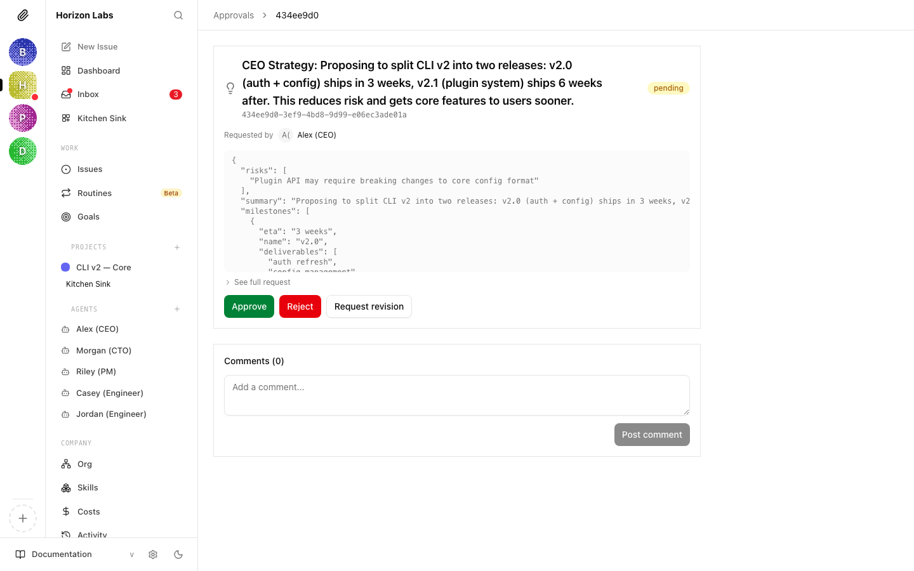

# Require board approval before an agent spends money

Budget caps are reactive. They warn at 80% and hard-stop at 100% — useful for bounding the runaway case, useless for *"don't sign up for this $40/month SaaS without asking me first."* For lumpy, discrete spend that needs a human go-ahead **before** the dollars move, you want an approval gate: the agent stops, posts a `request_board_approval`, and waits for your decision before continuing.

This guide wires that pattern end-to-end on a test company. Time to working approval round-trip: about 5 minutes.

---

## 1. Approvals vs. hard caps — when to use which

| Concern | Hard budget cap (HT1) | Spend approval (this guide) |
|---|---|---|
| Trigger | Cumulative spend crosses a percent threshold | Agent decides an action exceeds policy |
| Direction | Reactive — fires after the dollars are spent | Proactive — fires before the action happens |
| Granularity | Aggregate per scope (company, agent, project) per month | Per-decision, with the proposal in the payload |
| What stops | The whole scope pauses (no more heartbeats) | Only the specific spend; the agent keeps working other tasks |
| Who acts | Board resolves the incident on the Costs page | Board approves/rejects on the Approvals page |

Use **both**. The cap is your safety net — it catches what slips through the contract. The approval gate is the contract: anything above $X, anything recurring, anything outside a pre-approved provider list, requires a board decision before the agent commits.

> **Already over a hard cap?** That generates a `budget_override_required` approval automatically — see [Set a monthly budget and enforce it](./set-monthly-budget.md) for that flow. The gate this guide describes is the agent-initiated `request_board_approval`, which is a different pattern.

---

## 2. Make it the agent's contract

Paperclip does not auto-detect "this code is about to spend money." There is no interceptor on the OpenAI client. The gate lives in the agent's own playbook — usually `HEARTBEAT.md` or a dedicated skill — and it has two halves.

**Half one: the rule.** Add a short, mechanical clause to the agent's instructions describing what crosses the line:

```md
## Spend gate

Before any of the following, you MUST stop and create a `request_board_approval` on the
current issue. Do not commit, sign up, charge a card, or change a paid plan until you have
been woken with `PAPERCLIP_APPROVAL_STATUS=approved` for that approval.

- Any one-time spend ≥ $25
- Any new recurring subscription, regardless of cost
- Switching a model that increases per-token cost by more than 2x
- Any payment to a third party not already on the approved-vendors list

If the approval is rejected, abandon the spend and comment on the source issue with the
reason. Do not retry without new direction.
```

**Half two: the helper.** Most agents resolve the rule with a tiny shared procedure that creates the approval, marks the issue blocked, and exits. The exact shape depends on your runtime — bash if you wrote a webhook handler, Python or TypeScript if you wrote a custom script, a skill file if you ride on `claude_local`. Section 3 shows the shape end-to-end.

> **Why instructions, not code?** A real spend interceptor would have to wrap every HTTP client an agent might use, plus filesystem writes that touch credentials, plus shell calls. Paperclip is not in that path. Putting the gate in the agent's instructions keeps it in the same surface as everything else the agent decides — auditable in the run transcript, editable on the Instructions tab, the same shape as every other procedure the agent follows.

---

## 3. Submit the approval (`request_board_approval`)

The agent posts to the company approvals route with `type: request_board_approval`. The payload is the proposal the board sees:

```bash
ISSUE_ID="<the-issue-driving-the-spend>"

curl -X POST "$PAPERCLIP_API_URL/api/companies/$COMPANY_ID/approvals" \
  -H "Authorization: Bearer $PAPERCLIP_API_KEY" \
  -H "Content-Type: application/json" \
  -d @- <<JSON
{
  "type": "request_board_approval",
  "issueIds": ["$ISSUE_ID"],
  "payload": {
    "title": "Approve Vercel Pro for the staging deploy",
    "summary": "Hosting the staging environment for the customer pilot. Free tier hits the build-minutes cap at the third deploy of the day; Pro removes that ceiling.",
    "recommendedAction": "Approve a Vercel Pro subscription on the team plan billed to the company card.",
    "estimatedCostCents": 2000,
    "cadence": "monthly",
    "vendor": "Vercel",
    "risks": [
      "Recurring charge — needs explicit cancellation if we drop the pilot.",
      "Build minutes still capped per project; very large monorepos can hit the soft cap."
    ],
    "alternativesConsidered": [
      "Stay on free tier and hand-trigger deploys — viable but slows the feedback loop to the customer."
    ]
  }
}
JSON
```

A few things about that payload:

- **`title`** is the one-liner the board sees in the queue. Make it specific enough to decide on without opening the detail view.
- **`summary`** is one paragraph — the *why*, not the *what*. The recommended action covers the what.
- **`recommendedAction`** is the exact thing that should happen if approved. The board approves the action, not the explanation.
- **`risks`** is a short array. Keep it tight; risks the board can't act on are noise.
- **Anything else** you put in the payload (`estimatedCostCents`, `vendor`, `cadence`, `alternativesConsidered`) appears under **See full request** on the detail view. Use this for structured fields your agent populates consistently — they make audits easier later.

`issueIds` links the approval back to the issue that triggered it. The board uses this to navigate from the approval to the work; the agent uses it to find which issue to resume on wake.

After submitting, the agent should park the source issue and exit:

```bash
APPROVAL_ID=$(curl -s -X POST "$PAPERCLIP_API_URL/api/companies/$COMPANY_ID/approvals" \
  -H "Authorization: Bearer $PAPERCLIP_API_KEY" \
  -H "Content-Type: application/json" \
  -d @approval.json | jq -r .id)

curl -X PATCH "$PAPERCLIP_API_URL/api/issues/$ISSUE_ID" \
  -H "Authorization: Bearer $PAPERCLIP_API_KEY" \
  -H "X-Paperclip-Run-Id: $PAPERCLIP_RUN_ID" \
  -H "Content-Type: application/json" \
  -d "{
    \"status\": \"blocked\",
    \"comment\": \"Waiting on board approval [${APPROVAL_ID}](/PAP/approvals/${APPROVAL_ID}) before continuing.\"
  }"
```

`blocked` is correct here even though no other issue is the blocker — the unblocker is a board decision, not a sibling task. When the approval resolves, the agent unblocks itself in the wake handler (Section 5).

> **Idempotency.** Heartbeats can re-fire. Before posting a new approval, the agent should check whether one already exists for the same `issueId` and is still `pending`/`revision_requested`. The cheapest check is a list call:
>
> ```bash
> curl "$PAPERCLIP_API_URL/api/companies/$COMPANY_ID/approvals?status=pending,revision_requested" \
>   -H "Authorization: Bearer $PAPERCLIP_API_KEY" | jq '[.[] | select(.payload.title=="Approve Vercel Pro for the staging deploy")] | length'
> ```
>
> If the count is non-zero, do not re-submit; just exit.

---

## 4. Board-side experience

The approval lands in **Approvals → Pending** with a yellow badge.


Open it. The detail view shows the three structured fields up top (title, summary, recommended action), the risks as a bulleted list, a **See full request** expander for any extra payload fields the agent included, and a **Comments** thread for back-and-forth that does not warrant a full revision request.

The decision buttons sit at the bottom — same three buttons every approval gets:



- **Approve** — the agent is woken with `PAPERCLIP_APPROVAL_STATUS=approved` and proceeds with the spend.
- **Reject** — the agent is woken with `PAPERCLIP_APPROVAL_STATUS=rejected` and abandons the spend per its instructions.
- **Request Revision** — the approval enters `revision_requested`, your `decisionNote` is stored, and the agent is *not* automatically woken (see the gotcha at the end of Section 5).

The same actions are available on the API:

```bash
# Approve
curl -X POST "$PAPERCLIP_API_URL/api/approvals/$APPROVAL_ID/approve" \
  -H "Authorization: Bearer $BOARD_TOKEN"

# Reject with a reason — the reason lands on the approval and is visible to the agent on wake
curl -X POST "$PAPERCLIP_API_URL/api/approvals/$APPROVAL_ID/reject" \
  -H "Authorization: Bearer $BOARD_TOKEN" \
  -H "Content-Type: application/json" \
  -d '{"decisionNote": "Wait until we have customer commitment before paid hosting."}'

# Send back for changes
curl -X POST "$PAPERCLIP_API_URL/api/approvals/$APPROVAL_ID/request-revision" \
  -H "Authorization: Bearer $BOARD_TOKEN" \
  -H "Content-Type: application/json" \
  -d '{"decisionNote": "Same intent, but try the Hobby tier first ($0). Resubmit with that as the action."}'
```

For the full UI walkthrough, including queue filters and the comments thread, see [Approvals (board guide)](../guides/day-to-day/approvals.md).

---

## 5. Agent wake on resolution

When you approve or reject, Paperclip wakes the requesting agent with two extra environment variables:

| Var | Value |
|---|---|
| `PAPERCLIP_APPROVAL_ID` | UUID of the resolved approval. |
| `PAPERCLIP_APPROVAL_STATUS` | `approved` or `rejected`. |

The agent's heartbeat looks at these first, before checking the inbox:

```python
import os, requests

API   = os.environ["PAPERCLIP_API_URL"]
TOKEN = os.environ["PAPERCLIP_API_KEY"]
RUN_ID = os.environ.get("PAPERCLIP_RUN_ID", "")
H = {"Authorization": f"Bearer {TOKEN}", "Content-Type": "application/json"}
RH = {**H, "X-Paperclip-Run-Id": RUN_ID}

def heartbeat():
    approval_id = os.environ.get("PAPERCLIP_APPROVAL_ID")
    status      = os.environ.get("PAPERCLIP_APPROVAL_STATUS")

    if approval_id:
        return handle_approval(approval_id, status)

    # ... normal inbox-driven heartbeat ...

def handle_approval(approval_id, status):
    # 1. Re-fetch the approval (env vars are convenience; payload + decisionNote live on the record)
    approval = requests.get(f"{API}/api/approvals/{approval_id}", headers=H).json()

    # 2. Find the issue this approval was gating
    issues = requests.get(f"{API}/api/approvals/{approval_id}/issues", headers=H).json()
    if not issues:
        return  # approval wasn't linked to an issue; nothing to resume
    issue_id = issues[0]["id"]

    if status == "approved":
        # 3a. Do the gated spend, then move the issue forward
        provision_vercel_pro(approval["payload"])
        requests.patch(
            f"{API}/api/issues/{issue_id}",
            headers=RH,
            json={
                "status": "in_progress",
                "comment": f"Approval [{approval_id}](/PAP/approvals/{approval_id}) approved — provisioned Vercel Pro and resumed.",
            },
        )

    elif status == "rejected":
        # 3b. Abandon the spend; comment with the board's reason
        note = approval.get("decisionNote") or "No reason provided."
        requests.patch(
            f"{API}/api/issues/{issue_id}",
            headers=RH,
            json={
                "status": "in_progress",
                "comment": f"Approval [{approval_id}](/PAP/approvals/{approval_id}) rejected: {note}\n\nAbandoning the spend. Will not retry without new direction.",
            },
        )
```

Two important details about the wake:

- **The wake covers `approved` and `rejected` only.** `request-revision` does not fire `PAPERCLIP_APPROVAL_ID`. The board's `decisionNote` is stored on the approval; the agent learns about it on its next normal heartbeat (or sooner if you also leave a comment on the source issue, which *does* fire a wake — see [Debug a stuck heartbeat](./debug-stuck-heartbeat.md) for the full set of wake reasons).
- **Re-fetch the approval and the linked issues.** The env vars only carry the id and the verdict. The payload, the `decisionNote`, and the linked-issue list all live on the API and may have changed since the agent submitted the request — particularly after a revision round.

For BYO-agent runtimes that don't get Paperclip-driven wakes at all (the polling pattern in [Bring your own agent → Option C](./bring-your-own-agent.md#option-c--custom-script-no-paperclip-adapter)), poll the approval directly: `GET /api/approvals/$APPROVAL_ID` returns the current status. Loop with backoff and bail when `status != "pending"`.

---

## 6. Verify the round-trip

Before relying on the gate in production, prove the loop closes. Use a throwaway agent and a low-value approval.

1. **Make sure the agent's instructions name the gate.** Open the agent → **Instructions**, paste a minimal version of the rule from Section 2, save.

2. **Trigger the spend.** Assign the agent an issue that should hit the gate ("Sign up for the demo SaaS account"). Run a heartbeat — either let one fire on schedule or click **Run Heartbeat** in the agent header.

3. **Confirm the approval lands.** Open **Approvals → Pending**. You should see the request, with the proposal payload your agent submitted. Confirm `issueIds` links to the source issue.

4. **Approve from the API.** Use the `/approve` route from Section 4 against the approval id from step 3. The agent should be woken within seconds.

5. **Confirm the agent resumed.** Reopen the source issue. The status should be back to `in_progress` (or whatever your wake handler sets) and a new comment should be present, citing the approval id and stating what happened. Re-run with `/reject` to confirm the rejection branch behaves the same way.

If the agent doesn't wake after step 4, the most common causes are: (a) `requestedByAgentId` was not set on the approval and no agent ended up linked to it (the API auto-fills this for agent-authenticated callers, but board-authenticated callers must pass it explicitly); (b) the agent's adapter doesn't support out-of-band wakes (e.g. Option C in BYO — switch to polling); (c) the heartbeat handler reads the env vars *after* the inbox check and silently exits because the inbox is empty.

---

## 7. Patterns and gotchas

**Combine with budget caps, don't replace them.** The approval gate is enforced by the agent's own instructions. A new agent imported from another company, or a model that ignored its instructions, can bypass the gate. The hard cap from [HT1](./set-monthly-budget.md) catches the bypass and pauses the scope. Run both.

**One approval per spend, not per run.** If the agent re-runs before the previous approval resolves, the idempotency check from Section 3 prevents a duplicate. Without it, the board sees the same proposal twice and the agent has to disambiguate which one applies.

**Use the comments thread for clarification, not silent rejection.** If the proposal is *almost right*, post a comment on the approval (`POST /api/approvals/{approvalId}/comments`) instead of rejecting. The agent picks it up on its next heartbeat and can adjust. Reserve `request-revision` for cases where the agent needs to re-submit with a structurally different payload.

**Audit trail is automatic.** Every approval, decision, and decision note is on the approval record forever. `GET /api/approvals/{id}` is the canonical source — useful in retros ("why did we sign up for X?") and in compliance evidence ("here's the board approval, here's the timestamp, here's the requesting agent").

**Notifications.** The Approvals queue does not push to Slack or Discord on its own. If your board lives in chat and the queue would otherwise sit, [wire a notification routine](./wire-slack-discord-notifications.md) — the same shape as the hire-approval notifier.

---

## See also

- [Set a monthly budget and enforce it](./set-monthly-budget.md) — the reactive half of spend control. Run alongside this gate.
- [Approvals (board guide)](../guides/day-to-day/approvals.md) — the full UI walkthrough for the queue and decision buttons.
- [Approvals API](../reference/api/approvals.md) — every endpoint touched here, plus the lifecycle diagram and resubmit semantics.
- [Handle board approvals for hires](./handle-board-approvals-for-hires.md) — the same governance flow for the `hire_agent` approval type.
- [Wire Slack/Discord notifications](./wire-slack-discord-notifications.md) — pipe approvals into a channel so the queue doesn't sit.
- [Debug a stuck heartbeat](./debug-stuck-heartbeat.md) — first stop when the wake fires but the agent doesn't pick the approval up.
