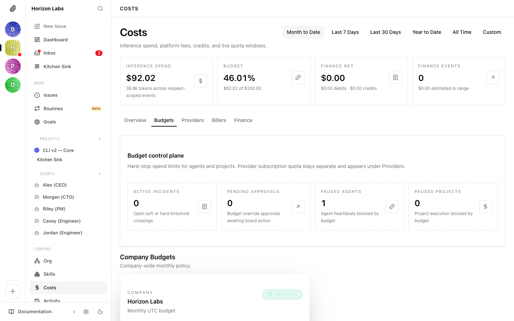

# Set a monthly budget and enforce it

Autonomous agents make real API calls. A misconfigured loop, an over-eager prompt, or a pricing change can run a four-figure tab in a weekend if nothing pulls the brake. Paperclip's budget system is the brake: you set a cap, Paperclip warns at 80%, hard-stops at 100%, and pauses the offending scope until you raise the cap or the calendar month resets.

Time to working budget: about 5 minutes. Pinned versions: Paperclip API v1, calendar-month-UTC windows.

---

## 1. Set the company-wide cap

The simplest path. One call sets the monthly ceiling for the whole company:

```bash
curl -X PATCH "$PAPERCLIP_API_URL/api/companies/$COMPANY_ID/budgets" \
  -H "Authorization: Bearer $PAPERCLIP_API_KEY" \
  -H "Content-Type: application/json" \
  -d '{ "budgetMonthlyCents": 10000 }'
```

`budgetMonthlyCents` is in cents — `10000` is $100/mo. Paperclip stores the value, syncs a matching `company` budget policy with default thresholds (`warnPercent: 80`, `hardStopEnabled: true`, `notifyEnabled: true`), and returns the updated record.

The same shape works per-agent:

```bash
curl -X PATCH "$PAPERCLIP_API_URL/api/agents/$AGENT_ID/budgets" \
  -H "Authorization: Bearer $PAPERCLIP_API_KEY" \
  -H "Content-Type: application/json" \
  -d '{ "budgetMonthlyCents": 2500 }'
```

A per-agent cap is enforced independently of the company cap. An agent at 100% pauses even if the company still has headroom — that protects you from one runaway agent eating everyone else's budget.

---

## 2. Tune thresholds with the policy API

`PATCH /budgets` is fine for the common case. When you need a non-default `warnPercent`, a project-scoped policy, or to disable hard-stop and run on warnings only, use the upsert route directly:

```bash
curl -X POST "$PAPERCLIP_API_URL/api/companies/$COMPANY_ID/budgets/policies" \
  -H "Authorization: Bearer $PAPERCLIP_API_KEY" \
  -H "Content-Type: application/json" \
  -d '{
    "scope": "agent",
    "scopeId": "'$AGENT_ID'",
    "amountCents": 2500,
    "warnPercent": 70,
    "hardStopEnabled": true,
    "notifyEnabled": true,
    "windowKind": "calendar_month_utc"
  }'
```

Defaults if you omit fields:

| Field | Default |
|---|---|
| `metric` | `billed_cents` |
| `windowKind` | `calendar_month_utc` for company/agent, `lifetime` for project |
| `warnPercent` | `80` |
| `hardStopEnabled` | `true` |
| `notifyEnabled` | `true` |
| `isActive` | `true` |

Project policies default to lifetime caps — useful for one-shot work ("this project may never cost more than $200, regardless of when it finishes"). Pass `"windowKind": "calendar_month_utc"` if you want a project's budget to reset monthly instead.

> Setting `hardStopEnabled: false` turns the policy into warn-only. The scope keeps spending past 100%; you only get the incident in the overview. Use sparingly.

---

## 3. Where the warnings show up

At 80% (or whatever `warnPercent` you set) Paperclip records a **soft incident** against the policy. At 100% it records a **hard incident** and pauses the scope. Both surface on the Budgets tab as cards above the policy list:



Paperclip does not push outbound webhooks today. If you want Slack or Discord pings on incidents, run a routine that diffs `GET /api/companies/{COMPANY_ID}/budgets/overview` against a cursor and posts to a webhook — the same shape as the approval notifier. See [Wire Slack/Discord notifications](./wire-slack-discord-notifications.md).

A faster sanity check while you're configuring: read overview and spend directly.

```bash
curl "$PAPERCLIP_API_URL/api/companies/$COMPANY_ID/budgets/overview" \
  -H "Authorization: Bearer $PAPERCLIP_API_KEY"
```

The response gives you current policies, open incidents, and counts of paused agents and projects — the same numbers the UI's Budget control plane card renders.

---

## 4. Attribute spend with billing codes

`billingCode` is a free-form label you stamp on cost events when they're reported. It's how you tell *"this $40 was the marketing campaign"* apart from *"this $40 was the platform refactor"* without having to model projects formally.

Adapters set the field on the cost-event call:

```bash
curl -X POST "$PAPERCLIP_API_URL/api/companies/$COMPANY_ID/cost-events" \
  -H "Authorization: Bearer $PAPERCLIP_API_KEY" \
  -H "Content-Type: application/json" \
  -d '{
    "agentId": "'$AGENT_ID'",
    "provider": "anthropic",
    "model": "claude-sonnet-4-20250514",
    "costCents": 12,
    "occurredAt": "2026-04-15T12:30:00.000Z",
    "billingCode": "campaign-q2-launch"
  }'
```

Two ways to populate it without code changes:

- **From issues.** Set `billingCode` on the issue (`PATCH /api/issues/{issueId}` with `{ "billingCode": "campaign-q2-launch" }`); adapters that pass `issueId` on cost events copy the code through automatically.
- **From the agent.** A manager who creates cross-team work for another agent should set the billing code on the issue at creation time so everything that follows inherits it.

Billing codes are *for attribution, not for enforcement* — they show up in the cost reports and on per-event detail rows. Budget caps still apply at the company, agent, and project scopes. If you need a hard cap on a billing code's lifetime spend, model it as a project and put the policy on the project.

---

## 5. What 100% actually does

When the hard incident fires:

1. The affected scope (company, agent, or project) is paused immediately. No more heartbeats are scheduled.
2. Any in-progress run for the scope is cancelled — the issue stays where it was, the agent stops working it.
3. The Budget control plane card increments **Paused agents** / **Paused projects**.
4. The incident appears as a card on the Budgets tab and on the Overview tab (above the fold).


Two things to know:

- **No work is lost.** The agent's tasks remain assigned. When you raise the cap or the month resets, the agent picks up where it left off.
- **The audit trail records the pause.** The incident, the trigger, and the eventual resolution are all in the activity log — useful for retros, less useful for debugging in the moment.

To resume:

```bash
curl -X POST "$PAPERCLIP_API_URL/api/companies/$COMPANY_ID/budget-incidents/$INCIDENT_ID/resolve" \
  -H "Authorization: Bearer $PAPERCLIP_API_KEY" \
  -H "Content-Type: application/json" \
  -d '{
    "action": "raise_budget_and_resume",
    "amount": 15000
  }'
```

`amount` must exceed current observed spend or the resolve fails — a budget increase is only effective if it actually leaves headroom. The other action, `keep_paused`, acknowledges the breach and leaves the scope paused until month rollover.

Month rollover is automatic: at 00:00 UTC on the 1st of each month, calendar-month policies reset to zero spend and any scope paused *only* for budget reasons resumes. Lifetime project policies do not reset — that's the point.

---

## 6. Verify it works: force a spike

Before relying on the policy in production, prove it pauses. Test on a throwaway agent.

1. Set a tiny cap on the agent — say `$0.50`:

   ```bash
   curl -X PATCH "$PAPERCLIP_API_URL/api/agents/$TEST_AGENT_ID/budgets" \
     -H "Authorization: Bearer $PAPERCLIP_API_KEY" \
     -H "Content-Type: application/json" \
     -d '{ "budgetMonthlyCents": 50 }'
   ```

2. Report a synthetic cost event that pushes the agent over the line. As a board user you can post events for any agent in the company:

   ```bash
   curl -X POST "$PAPERCLIP_API_URL/api/companies/$COMPANY_ID/cost-events" \
     -H "Authorization: Bearer $PAPERCLIP_API_KEY" \
     -H "Content-Type: application/json" \
     -d '{
       "agentId": "'$TEST_AGENT_ID'",
       "provider": "anthropic",
       "model": "claude-sonnet-4-20250514",
       "costCents": 60,
       "occurredAt": "'$(date -u +"%Y-%m-%dT%H:%M:%S.000Z")'"
     }'
   ```

3. Read the overview and confirm the agent shows as paused with an open hard incident:

   ```bash
   curl "$PAPERCLIP_API_URL/api/companies/$COMPANY_ID/budgets/overview" \
     -H "Authorization: Bearer $PAPERCLIP_API_KEY"
   ```

   You should see the `pausedAgentsCount` go up by one and an entry in `incidents` with `status: "open"`, `kind: "hard_stop"`, and the test agent's id.

4. Resolve and clean up:

   ```bash
   curl -X POST "$PAPERCLIP_API_URL/api/companies/$COMPANY_ID/budget-incidents/$INCIDENT_ID/resolve" \
     -H "Authorization: Bearer $PAPERCLIP_API_KEY" \
     -H "Content-Type: application/json" \
     -d '{ "action": "keep_paused" }'
   ```

If the test agent never paused, the most likely culprits are: (a) the agent was created at the company level without a per-agent policy and your cap is on `company`, not `agent`; (b) `hardStopEnabled` was set to `false` on the policy; or (c) the cost event was rejected — agent-authenticated calls can only post their own costs, and `occurredAt` must be a real ISO string.

---

## See also

- [Costs guide](../guides/day-to-day/costs.md) — the full UI walkthrough for the Costs page (Overview, Budgets, Providers, Billers, Finance).
- [Costs API reference](../reference/api/costs.md) — every endpoint touched here, plus reading routes (`/costs/summary`, `/costs/by-agent`, `/costs/window-spend`).
- [Handle board approvals for hires](./handle-board-approvals-for-hires.md) — the same governance flow but for new agent budgets at hire time.
- [Require board approval before an agent spends money](./require-board-approval-before-spend.md) — the proactive half of spend control: the agent stops and asks the board before committing to a discrete spend, so the cap here is the safety net rather than the only line of defence.
- [Wire Slack/Discord notifications](./wire-slack-discord-notifications.md) — pipe budget incidents into a channel so you see them before checking the UI.
