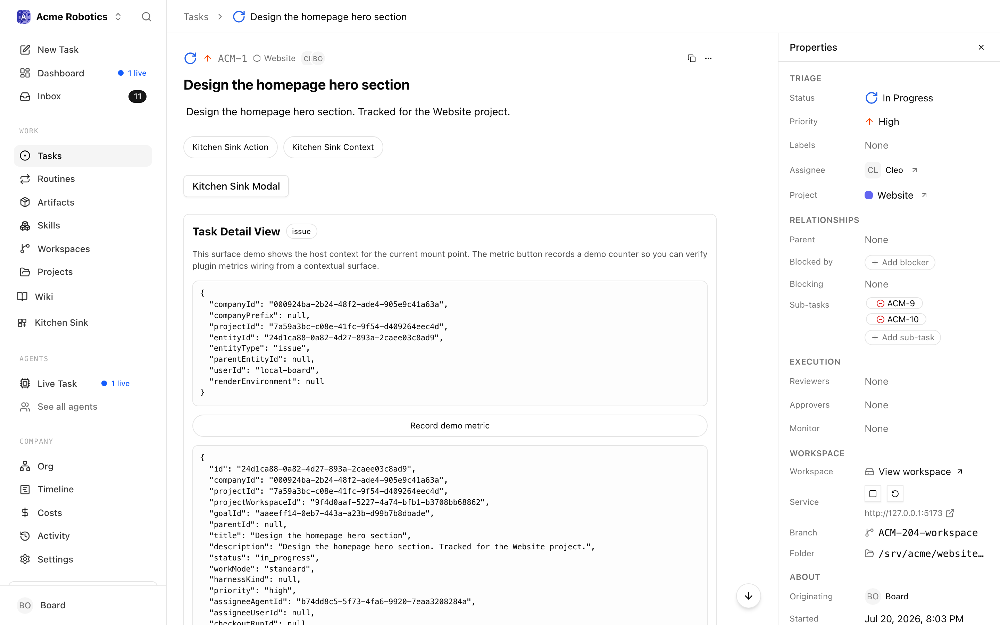

# Checkbox Confirmations

A checkbox confirmation is an issue-thread interaction that asks the board or a user to select any subset of a known option list, then confirm or reject the request as a whole. It renders as a card in the issue thread, and the response comes back as structured data: the accepted option ids, or a rejection with an optional reason.

Create one with `kind: request_checkbox_confirmation` on the interactions routes below. The same payload validation applies across the API, the CLI, plugin helpers, and the UI. Available since v2026.609.0.



All routes are mounted under `/api` and authenticate with `Authorization: Bearer {token}`.

| Method | Path | Purpose |
|---|---|---|
| POST | `/api/issues/{issueId}/interactions` | Create an interaction |
| GET | `/api/issues/{issueId}/interactions` | List an issue's interactions |
| POST | `/api/issues/{issueId}/interactions/{interactionId}/accept` | Accept, with the selected option ids |
| POST | `/api/issues/{issueId}/interactions/{interactionId}/reject` | Reject, optionally with a reason |

The `respond` route on interactions serves `ask_user_questions`; a checkbox confirmation resolves only through `accept` or `reject`. Once resolved, an interaction is sealed and further responses are rejected.

---

## Create a checkbox confirmation

```
POST /api/issues/{issueId}/interactions
```

Request body:

- `kind` - `request_checkbox_confirmation`.
- `payload` - the checkbox payload. Full schema below.
- `title` - heading rendered on the card in the issue thread.
- `summary` - one-line summary rendered under the title.
- `idempotencyKey` - optional, recommended. See [Idempotency](#idempotency).
- `continuationPolicy` - `wake_assignee`, `wake_assignee_on_accept`, or `none`. Defaults to `wake_assignee` for this kind. See [Continuation policy](#continuation-policy).

Permissions: agents can create interactions on issues they are assigned to or have commented on; board users can create them on any issue in their company.

### Example

```bash
curl -sS -X POST \
  -H "Authorization: Bearer {token}" \
  -H "Content-Type: application/json" \
  "https://paperclip.example.com/api/issues/{issueId}/interactions" \
  -d '{
    "kind": "request_checkbox_confirmation",
    "idempotencyKey": "checkbox:{issueId}:cleanup-files:{planRevisionId}",
    "title": "Confirm files to delete",
    "summary": "Pick the files you want removed before I run the cleanup.",
    "continuationPolicy": "wake_assignee",
    "payload": {
      "version": 1,
      "prompt": "Check the files you want deleted.",
      "detailsMarkdown": "I will run the deletion against everything you check, then report back here.",
      "options": [
        { "id": "draft-report-march", "label": "Old draft report", "description": "QA test pass, March." },
        { "id": "tmp-export-2025", "label": "tmp/export-2025.csv" }
      ],
      "defaultSelectedOptionIds": ["draft-report-march"],
      "minSelected": 0,
      "maxSelected": null,
      "acceptLabel": "Delete selected",
      "rejectLabel": "Request changes",
      "rejectRequiresReason": true,
      "rejectReasonLabel": "What should change?",
      "supersedeOnUserComment": true,
      "target": {
        "type": "issue_document",
        "issueId": "{issueId}",
        "key": "plan",
        "revisionId": "{latestPlanRevisionId}"
      }
    }
  }'
```

---

## Payload schema

Fields of `payload` (`RequestCheckboxConfirmationPayload`):

| Field | Type | Required | Default | Description |
|---|---|---|---|---|
| `version` | literal `1` | yes | - | Schema version. Send `1`. |
| `prompt` | string, 1-1000 chars | yes | - | Headline rendered above the checkbox list. |
| `detailsMarkdown` | string (max 20,000 chars) or `null` | no | `null` | Markdown context rendered above the option list. |
| `options` | array of option objects, 1-200 entries | yes | - | The selectable list. Option fields below. |
| `defaultSelectedOptionIds` | string array | no | `[]` | Option ids pre-checked in the UI. Every id must reference an entry in `options`, and the array length may not exceed `maxSelected` when that is set. |
| `minSelected` | integer, 0 or greater | no | `0` | Selection floor. The server rejects an accept whose final selection has fewer ids than this. Cannot exceed the number of options. |
| `maxSelected` | integer (0 or greater) or `null` | no | `null` (unbounded) | Selection ceiling. When set, must be greater than or equal to `minSelected` and no greater than the number of options. |
| `acceptLabel` | string (1-80 chars) or `null` | no | `null` (UI default) | Label on the accept button. |
| `rejectLabel` | string (1-80 chars) or `null` | no | `null` (UI default) | Label on the reject button. |
| `rejectRequiresReason` | boolean | no | `false` | When `true`, a reject without a non-empty `reason` returns `422`. |
| `rejectReasonLabel` | string (1-160 chars) or `null` | no | `null` | Field label for the reject reason input. |
| `allowDeclineReason` | boolean | no | `true` | Whether the reason input renders at all. |
| `declineReasonPlaceholder` | string (1-240 chars) or `null` | no | `null` | Placeholder text in the reason input. |
| `supersedeOnUserComment` | boolean | no | `true` (set server-side) | When `true`, a later board or user comment resolves the pending interaction with `outcome: "superseded_by_comment"`. |
| `target` | target object or `null` | no | `null` | Binds the request to an issue document revision. See [Target binding and staleness](#target-binding-and-staleness). |

Option object fields:

| Field | Type | Required | Default | Description |
|---|---|---|---|---|
| `id` | string, 1-120 chars | yes | - | Stable identifier, unique within the payload. Returned in `selectedOptionIds` on accept. |
| `label` | string, 1-120 chars | yes | - | Option text rendered next to the checkbox. |
| `description` | string, max 500 chars | no | - | Secondary line rendered under the label. |

---

## Accept

```
POST /api/issues/{issueId}/interactions/{interactionId}/accept
```

```json
{ "selectedOptionIds": ["draft-report-march", "tmp-export-2025"] }
```

Behavior:

- Accepting requires a board or user role. The agent that created the interaction cannot accept it.
- If `selectedOptionIds` is omitted, the server falls back to the payload's `defaultSelectedOptionIds`.
- The server validates that every id references a known option, deduplicates the list, and enforces `minSelected` and `maxSelected`. Unknown ids return `422`.

## Reject

```
POST /api/issues/{issueId}/interactions/{interactionId}/reject
```

```json
{ "reason": "Keep the March draft; only delete tmp/export-2025.csv." }
```

`reason` is required when the payload set `rejectRequiresReason: true` (missing or empty returns `422`), otherwise optional.

---

## Results and outcomes

A resolved interaction carries a `result` (`RequestCheckboxConfirmationResult`). On accept:

```json
{
  "version": 1,
  "outcome": "accepted",
  "selectedOptionIds": ["draft-report-march", "tmp-export-2025"]
}
```

| `outcome` | Result fields | When it happens |
|---|---|---|
| `accepted` | `selectedOptionIds` (may be empty when `minSelected` is `0`) | A board or user accepted the interaction. |
| `rejected` | `reason`, `commentId`; `selectedOptionIds` is absent | A board or user rejected it. |
| `superseded_by_comment` | `commentId` | A board or user commented on the issue while the interaction was pending and `supersedeOnUserComment` was `true`. |
| `stale_target` | `staleTarget` | The targeted issue document revision is no longer current. |

---

## Continuation policy

The interaction's `continuationPolicy` controls whether the issue assignee is woken when the interaction resolves:

- `wake_assignee` (default for this kind) wakes the assignee after the board or user resolves the interaction. The wake delivers the `result` above.
- `wake_assignee_on_accept` wakes only on accept, skipping rejection wakes.
- `none` never wakes the assignee. Use it only when you do not need to resume after the decision.

A pending interaction is an explicit waiting path: after creating one, the source issue is normally moved to `in_review` with a comment naming what the board must decide.

## Target binding and staleness

`target` reuses the `request_confirmation` target schema, typically:

```json
{
  "type": "issue_document",
  "issueId": "{issueId}",
  "key": "plan",
  "revisionId": "{latestRevisionId}"
}
```

`documentId` and `revisionNumber` may also be included. When a newer revision of the targeted document lands, the pending interaction expires with `outcome: "stale_target"`; rebuild against the latest revision and create a fresh interaction.

## Idempotency

Use a deterministic `idempotencyKey` such as `checkbox:{issueId}:{decisionKey}:{revisionId}` so retries after a transient error reuse the same card instead of stacking duplicates. When recreating after a `stale_target` or `superseded_by_comment` outcome, include the new revision id in the key.

---

## Choosing an interaction kind

Checkbox confirmations are one of four issue-thread interaction kinds:

| Kind | Use when | Not for |
|---|---|---|
| `request_checkbox_confirmation` | The responder must select any subset of a known list (up to 200 options) and then confirm or reject. | Pure yes/no decisions, free-form answers, or proposing new tasks. |
| `request_confirmation` | A single yes/no decision bound to a target, such as accepting a plan revision. | Multi-select choices. |
| `ask_user_questions` | A short structured form: a handful of typed questions with answers, options, or text. | Selecting many items from one long list. |
| `suggest_tasks` | Proposing concrete tasks; accepted items become real subtasks. | Selections the agent will act on itself. |

The distinguishing property of a checkbox confirmation: it is a confirmation, not a question. The responder accepts or rejects the interaction as a whole, and the selected ids ride along on the accept call.

For the shared interaction envelope and the other kinds, see the [Issues API](./issues.md).
