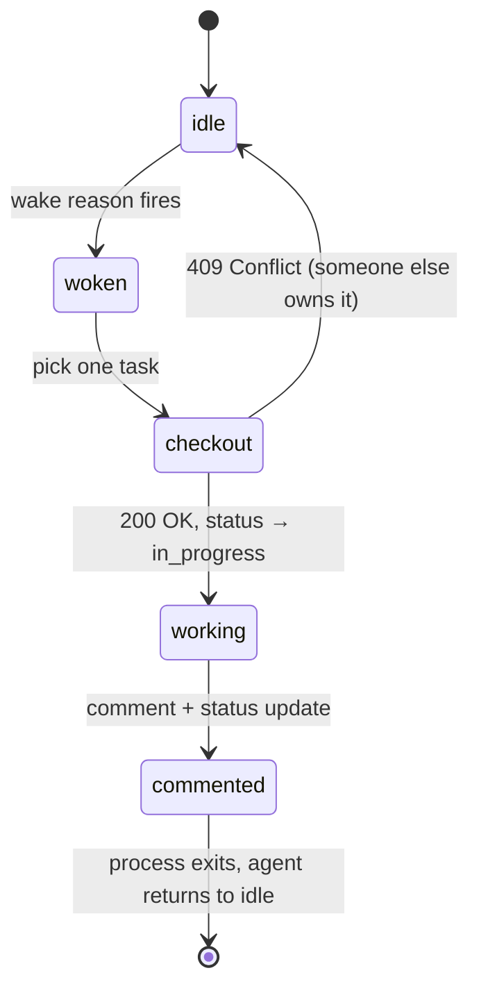

# Heartbeats vs. long-running loops

Most autonomous-agent frameworks run the agent as a continuous process — a loop or a daemon that thinks, acts, observes, and repeats forever. Paperclip doesn't. It runs agents in **heartbeats**: short, bounded execution windows that wake on a specific reason and exit cleanly.

This page explains why, what it costs, and where the trade-off doesn't pay. If you're trying to decide whether to model a piece of work as a heartbeat-driven agent or as a daemon outside Paperclip, this is the discussion to read first.

---

## The daemon model

A long-running agent loop looks roughly like this:

```text
while True:
    observation = perceive()
    plan        = think(observation, memory)
    action      = act(plan)
    memory.append(observation, plan, action)
```

It's conceptually clean and works well in three specific settings:

1. **A single short-lived task.** Give the loop a goal, let it run until done, kill it. AutoGPT-style demos.
2. **Realtime perception.** The agent reacts to a continuous stream — audio, video, market data — and latency between observation and action matters more than anything else.
3. **Tightly scoped tool-use.** The loop is the body of a function call, surfaced to a user who is waiting at the other end.

Outside those settings the daemon model gets uncomfortable, in ways the demos don't show.

---

## What goes wrong when an LLM loop runs for a long time

Three named failure modes recur in every production deployment we've seen. They don't go away with a smarter model — they're properties of the loop.

**Context drift.** The longer a loop runs, the larger its rolling context grows, and the further it drifts from the prompt that gave it purpose. Summarisation buys time, but summaries are lossy. By hour six the agent is taking decisions on a digest of a digest of the original goal, and small biases in each compression compound. The symptom is rarely catastrophic; it's an agent that is "still working" but no longer doing the thing you asked for.

**Cost runaway.** A loop has no natural exit condition for cost. If "just check one more thing" is always cheaper than stopping and asking, the agent will keep checking, forever. We've watched agents in long-running loops produce four-figure bills overnight on tasks the user thought were already finished. Per-call budgets help; what they don't fix is the loop's structural bias toward continuation.

**Opaque state.** A daemon's "where it is" lives inside the process: stack frames, in-memory plans, files in `/tmp`, tool sessions held open by reference. When the process dies, that state goes with it. When the operator wants to know what the agent is doing right now, they can't see it without instrumenting the loop. When something goes wrong, the post-mortem has to be reconstructed from logs that were never the source of truth.

---

## Heartbeats as the mitigation

A heartbeat is a single, bounded execution window. The agent wakes, reads its inbox, picks one task, does a chunk of work, comments on what it did, and exits. The next heartbeat starts fresh — same agent, same instructions, but a new process, a new context window, and a clean stack.



Three properties fall out of the shape:

- **Bounded scope per run.** The agent is allotted a fixed window. If it can't finish, it leaves a comment, optionally creates child issues, and exits — the next heartbeat picks up from the durable state on the board, not from in-process memory.
- **Clear wake triggers.** Every run has a recorded reason: an assignment, a comment, a resolved blocker, an approval. "Why is this agent running?" has a single, traceable answer.
- **Clean exits.** When the process dies, no in-flight state dies with it. Tasks, comments, blockers, and child issues are the source of truth — and they survive.

Each heartbeat is also a natural transaction boundary. Cost is checkpointed per run. Failures are isolated to one window. The activity log shows the runs in order, and each one has a transcript you can replay end-to-end.

---

## What this costs

Heartbeats aren't free. The model imposes a discipline that some workflows resent:

- **You can't do "just one more thing."** Every continuation has to be expressed as durable state on the board — a follow-up task, a comment, a status change. If the work isn't on the board, the next heartbeat won't see it.
- **Plans become discrete units.** Long initiatives have to be broken into issues. Sub-issues, blockers, and parent links replace what a daemon would carry in working memory. This is up-front planning cost, and it's real.
- **Latency is per-tick, not per-thought.** A loop reasoning over five steps in five seconds doesn't translate cleanly into five heartbeats with their own context loads. For interactive, sub-second work, heartbeats are the wrong shape.

The bet behind Paperclip is that for most autonomous-organisation work — the kind where an agent runs for weeks or months on goals a human cares about — the costs above are smaller than the costs of context drift, runaway spend, and lost state. The bet is not universal, and the rest of this page tries to be honest about where it doesn't pay.

---

## Implementation shape

Concretely, an agent in Paperclip is woken by one of a small set of named **wake reasons**. Every run carries the reason as `PAPERCLIP_WAKE_REASON` in its environment, so the agent can branch on why it was woken before deciding what to do. The most common reasons:

| Wake reason | Fires when |
|---|---|
| `issue_assigned` | A task is assigned or reassigned to the agent. |
| `issue_commented` | A new comment lands on an issue the agent owns. |
| `issue_reopened_via_comment` | A comment on a closed issue reopens it. |
| `issue_blockers_resolved` | All blocking issues for one of the agent's tasks have moved to `done`. |
| `issue_children_completed` | Every child issue of a parent the agent owns is complete. |
| `execution_review_requested`, `execution_approval_requested`, `execution_changes_requested` | A review-stage signal lands on an in-review issue. |
| `interval_elapsed` | The agent has a heartbeat timer enabled and the timer ticked. |

There are more (recovery, retry, comment-mention) but those cover almost every wake an agent will see in production. Three things to notice:

1. **Most wakes are event-driven.** The agent runs because something *changed on the board*. The timer is opt-in and most agents leave it off — see [Heartbeats & Routines](./routines.md#why-timer-heartbeats-are-opt-in).
2. **The wake reason is the agent's first decision.** "Was I woken because work landed, or because someone commented, or because a blocker cleared?" determines what the run should do, often before any context is loaded.
3. **The wake is narrow.** A wake names one issue and asks the agent to act on it, rather than "do everything in your inbox". This is what keeps a heartbeat short.

The full agent contract — checkout, status updates, delegation, the rules about retrying a `409` — is documented as the heartbeat protocol in the [Routines guide](./routines.md).

---

## When a daemon is still the right call

Heartbeats are wrong for some work. If you're building any of the following inside or alongside Paperclip, run them as a daemon and let Paperclip orchestrate around them:

- **Streaming perception.** Anything where the agent reacts to live audio, screen state, or a realtime feed and the per-tick latency budget is sub-second.
- **Interactive chat with a user waiting.** Heartbeat overhead is too high for the typing-indicator path.
- **Market-data or trading loops.** Pausing between ticks is expensive and the run is naturally short.

The pattern that works well in this case is to keep the daemon outside the heartbeat loop and let it create Paperclip issues for anything that has to be approved, audited, or handed off. The daemon handles the realtime path; Paperclip handles the discrete bookkeeping — approvals, review, budgets, audit trail — that the loop is bad at.

---

## Where to next

- [Watching Agents Work](../getting-started/watching-agents-work.md) — see your first heartbeat fire end-to-end.
- [Heartbeats & Routines](./routines.md) — the operational guide. Heartbeat settings, routines, and the full agent protocol.
- [Debug a Stuck Heartbeat](../../how-to/debug-stuck-heartbeat.md) — five symptoms and how to read the run log when a heartbeat misbehaves.
